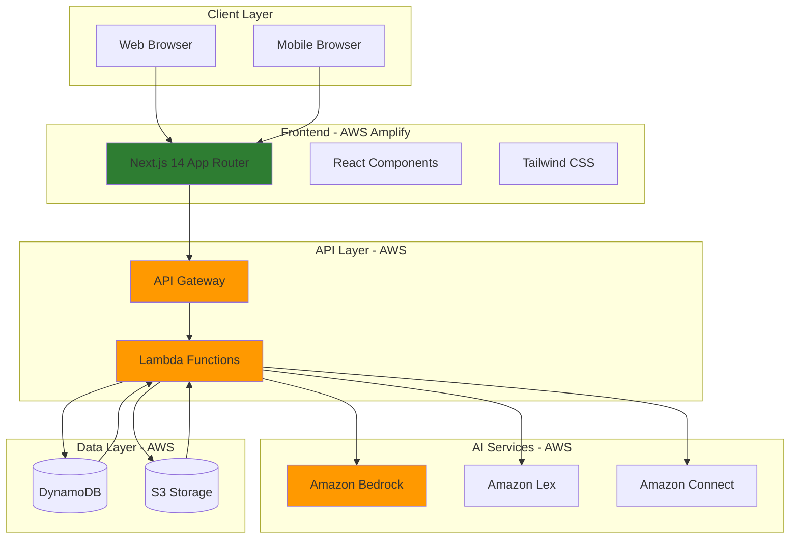
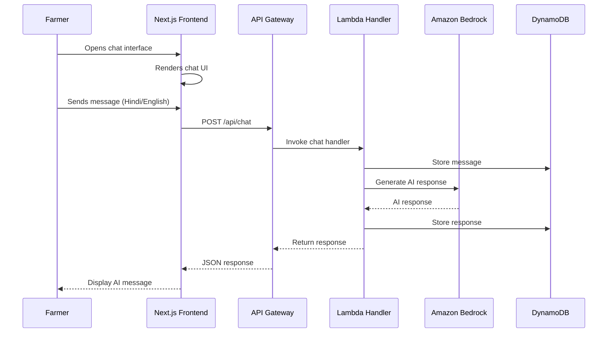

# Design Document: KrishiMitra AI SaaS Web Application

## Overview

The KrishiMitra AI SaaS Web Application is a modern, production-ready web platform that complements the existing voice-first telephony system. It provides farmers with a visual interface to access AI-powered agricultural guidance, weather intelligence, government schemes information, and market insights through an intuitive chat interface. The application is built using Next.js 14 with TypeScript, deployed on AWS Amplify, and integrates with AWS services including Bedrock for AI capabilities, Lambda for backend logic, API Gateway for RESTful APIs, and DynamoDB for data persistence.

The platform targets Indian farmers with multilingual support (Hindi and English), offering both text-based chat interactions and voice helpline simulation. The design emphasizes mobile responsiveness, fast loading times, and a premium SaaS user experience with glassmorphism design elements and agricultural theming. The application serves as a hackathon-ready demonstration of scalable, AWS-powered agricultural AI technology while maintaining production-grade architecture and code quality.

## Architecture

### High-Level System Architecture



### Component Interaction Flow



### Data Flow Architecture

1. **User Interaction**: Farmer accesses homepage, navigates to chat dashboard
2. **Message Submission**: User types question in Hindi or English
3. **API Request**: Frontend sends POST request to API Gateway endpoint
4. **Authentication**: API Gateway validates request (optional JWT token)
5. **Lambda Processing**: Handler function receives event, extracts message
6. **Context Retrieval**: Lambda fetches user session from DynamoDB
7. **AI Generation**: Lambda calls Bedrock with message + context
8. **Response Storage**: Lambda stores conversation in DynamoDB
9. **Response Delivery**: Lambda returns formatted response to frontend
10. **UI Update**: React component displays AI response with animation

### Scalability and Performance Architecture

**Frontend Optimization**:
- Next.js 14 App Router with React Server Components for reduced client-side JavaScript
- Static page generation for homepage, about, and contact pages
- Dynamic rendering for chat dashboard with streaming responses
- Image optimization with Next.js Image component
- Code splitting and lazy loading for non-critical components
- CDN distribution via AWS Amplify for global edge caching

**Backend Scalability**:
- Serverless Lambda functions with auto-scaling (0 to 1000+ concurrent executions)
- API Gateway with throttling and rate limiting
- DynamoDB with on-demand capacity mode for automatic scaling
- Connection pooling for DynamoDB and external service calls
- Caching layer using Lambda memory for frequently accessed data

**Performance Targets**:
- Homepage First Contentful Paint: < 1.5 seconds
- Time to Interactive: < 3 seconds
- Chat message response time: < 2 seconds
- API Gateway latency: < 100ms
- Lambda cold start: < 500ms
- Lambda warm execution: < 200ms

## Components and Interfaces

### 1. Frontend Application (Next.js 14)

**Responsibilities**:
- Render responsive UI for all pages (homepage, chat dashboard, about, contact)
- Handle user interactions and form submissions
- Manage client-side state for chat conversations
- Communicate with backend APIs
- Implement real-time chat UI with typing indicators and animations
- Support multilingual content (Hindi and English)
- Provide accessible, mobile-first user experience

**Technology Stack**:
- Next.js 14 (App Router)
- React 18 with Server Components
- TypeScript for type safety
- Tailwind CSS for styling
- React Context API for state management

**Key Pages**:

**a) Homepage (`app/page.tsx`)**
```typescript
interface HomePageProps {
  // Server component - no props needed
}

export default async function HomePage(): Promise<JSX.Element> {
  // Server-side rendering for SEO
  return (
    <>
      <Header />
      <HeroSection />
      <TrustStrip />
      <FeaturesSection />
      <VoiceHelplineSection />
      <ChatPreviewSection />
      <AWSArchitectureSection />
      <Footer />
    </>
  );
}
```

**b) Chat Dashboard (`app/chat/page.tsx`)**
```typescript
interface Message {
  id: string;
  role: 'user' | 'assistant';
  content: string;
  timestamp: Date;
  language: 'hi' | 'en';
}

interface ChatDashboardProps {
  searchParams: { session?: string };
}

export default function ChatDashboard({ searchParams }: ChatDashboardProps): JSX.Element {
  // Client component for interactivity
  return (
    <div className="chat-container">
      <ChatHeader />
      <MessageList />
      <ChatInput />
      <LanguageSelector />
    </div>
  );
}
```

**c) About Page (`app/about/page.tsx`)**
```typescript
export default async function AboutPage(): Promise<JSX.Element> {
  return (
    <>
      <Header />
      <AboutHero />
      <MissionSection />
      <TeamSection />
      <TechnologySection />
      <Footer />
    </>
  );
}
```

**d) Contact Page (`app/contact/page.tsx`)**
```typescript
interface ContactFormData {
  name: string;
  email: string;
  phone?: string;
  message: string;
  language: 'hi' | 'en';
}

export default function ContactPage(): JSX.Element {
  return (
    <>
      <Header />
      <ContactForm />
      <ContactInfo />
      <Footer />
    </>
  );
}
```

**Component Interface Contracts**:

```typescript
// Chat Message Component
interface ChatMessageProps {
  message: Message;
  isTyping?: boolean;
}

export function ChatMessage({ message, isTyping }: ChatMessageProps): JSX.Element;

// Chat Input Component
interface ChatInputProps {
  onSendMessage: (content: string, language: 'hi' | 'en') => Promise<void>;
  disabled?: boolean;
  placeholder?: string;
}

export function ChatInput({ onSendMessage, disabled, placeholder }: ChatInputProps): JSX.Element;

// Language Selector Component
interface LanguageSelectorProps {
  currentLanguage: 'hi' | 'en';
  onLanguageChange: (language: 'hi' | 'en') => void;
}

export function LanguageSelector({ currentLanguage, onLanguageChange }: LanguageSelectorProps): JSX.Element;
```

### 2. API Gateway

**Responsibilities**:
- Expose RESTful API endpoints for frontend consumption
- Handle request routing to appropriate Lambda functions
- Implement authentication and authorization (JWT validation)
- Apply rate limiting and throttling
- Transform requests and responses
- Enable CORS for frontend domain
- Provide API documentation via OpenAPI/Swagger

**Endpoints**:

```typescript
// Chat API
POST /api/chat
Request: {
  message: string;
  language: 'hi' | 'en';
  sessionId?: string;
  userId?: string;
}
Response: {
  response: string;
  sessionId: string;
  timestamp: string;
  language: 'hi' | 'en';
}

// Session Management
GET /api/sessions/{sessionId}
Response: {
  sessionId: string;
  messages: Message[];
  createdAt: string;
  updatedAt: string;
}

// Contact Form
POST /api/contact
Request: {
  name: string;
  email: string;
  phone?: string;
  message: string;
  language: 'hi' | 'en';
}
Response: {
  success: boolean;
  messageId: string;
}

// Health Check
GET /api/health
Response: {
  status: 'healthy' | 'degraded' | 'unhealthy';
  timestamp: string;
  services: {
    bedrock: boolean;
    dynamodb: boolean;
    lambda: boolean;
  };
}
```

**Configuration**:
- Stage: production, staging, development
- Throttling: 1000 requests per second per API key
- Burst limit: 2000 requests
- CORS: Allow origin from Amplify domain
- Request validation: JSON schema validation enabled
- API Keys: Required for production environment

### 3. Lambda Functions (Backend Service)

**Responsibilities**:
- Process API requests from API Gateway
- Interact with Amazon Bedrock for AI responses
- Manage conversation context and session state
- Store and retrieve data from DynamoDB
- Implement business logic for chat, contact forms, and data retrieval
- Handle errors gracefully with proper logging
- Optimize for cold start performance

**Functions**:

**a) Chat Handler (`lambda/chat-handler.ts`)**

```typescript
interface ChatEvent {
  body: string; // JSON stringified ChatRequest
  headers: Record<string, string>;
  requestContext: {
    requestId: string;
    identity: {
      sourceIp: string;
    };
  };
}

interface ChatRequest {
  message: string;
  language: 'hi' | 'en';
  sessionId?: string;
  userId?: string;
}

interface ChatResponse {
  response: string;
  sessionId: string;
  timestamp: string;
  language: 'hi' | 'en';
}

export async function handler(event: ChatEvent): Promise<APIGatewayProxyResult> {
  try {
    const request: ChatRequest = JSON.parse(event.body);
    
    // Validate input
    if (!request.message || request.message.trim().length === 0) {
      return createErrorResponse(400, 'Message is required');
    }
    
    // Get or create session
    const sessionId = request.sessionId || generateSessionId();
    
    // Retrieve conversation history
    const history = await getConversationHistory(sessionId);
    
    // Call Amazon Bedrock for AI response
    const aiResponse = await generateAIResponse(
      request.message,
      request.language,
      history
    );
    
    // Store message and response in DynamoDB
    await storeMessage(sessionId, 'user', request.message, request.language);
    await storeMessage(sessionId, 'assistant', aiResponse, request.language);
    
    // Return response
    const response: ChatResponse = {
      response: aiResponse,
      sessionId,
      timestamp: new Date().toISOString(),
      language: request.language
    };
    
    return createSuccessResponse(200, response);
    
  } catch (error) {
    console.error('Chat handler error:', error);
    return createErrorResponse(500, 'Internal server error');
  }
}
```

**b) Bedrock Integration Service**

```typescript
import { BedrockRuntimeClient, InvokeModelCommand } from '@aws-sdk/client-bedrock-runtime';

interface ConversationMessage {
  role: 'user' | 'assistant';
  content: string;
}

async function generateAIResponse(
  message: string,
  language: 'hi' | 'en',
  history: ConversationMessage[]
): Promise<string> {
  const client = new BedrockRuntimeClient({ region: 'us-east-1' });
  
  // Build system prompt based on language
  const systemPrompt = language === 'hi'
    ? 'आप कृषि मित्र हैं, एक AI सहायक जो भारतीय किसानों की मदद करता है। फसल, मौसम, सरकारी योजनाओं और बाजार की कीमतों के बारे में जानकारी प्रदान करें।'
    : 'You are KrishiMitra, an AI assistant helping Indian farmers. Provide information about crops, weather, government schemes, and market prices.';
  
  // Prepare conversation context
  const conversationContext = history.map(msg => ({
    role: msg.role,
    content: msg.content
  }));
  
  // Add current message
  conversationContext.push({
    role: 'user',
    content: message
  });
  
  // Prepare Bedrock request (using Claude 3 Sonnet)
  const payload = {
    anthropic_version: 'bedrock-2023-05-31',
    max_tokens: 1024,
    system: systemPrompt,
    messages: conversationContext,
    temperature: 0.7,
    top_p: 0.9
  };
  
  const command = new InvokeModelCommand({
    modelId: 'anthropic.claude-3-sonnet-20240229-v1:0',
    contentType: 'application/json',
    accept: 'application/json',
    body: JSON.stringify(payload)
  });
  
  const response = await client.send(command);
  const responseBody = JSON.parse(new TextDecoder().decode(response.body));
  
  return responseBody.content[0].text;
}
```

**c) DynamoDB Service**

```typescript
import { DynamoDBClient } from '@aws-sdk/client-dynamodb';
import { DynamoDBDocumentClient, PutCommand, QueryCommand } from '@aws-sdk/lib-dynamodb';

const client = new DynamoDBClient({ region: 'us-east-1' });
const docClient = DynamoDBDocumentClient.from(client);

const MESSAGES_TABLE = process.env.MESSAGES_TABLE || 'krishi-mitra-messages';

interface MessageRecord {
  sessionId: string;
  timestamp: string;
  messageId: string;
  role: 'user' | 'assistant';
  content: string;
  language: 'hi' | 'en';
}

async function storeMessage(
  sessionId: string,
  role: 'user' | 'assistant',
  content: string,
  language: 'hi' | 'en'
): Promise<void> {
  const record: MessageRecord = {
    sessionId,
    timestamp: new Date().toISOString(),
    messageId: generateMessageId(),
    role,
    content,
    language
  };
  
  const command = new PutCommand({
    TableName: MESSAGES_TABLE,
    Item: record
  });
  
  await docClient.send(command);
}

async function getConversationHistory(
  sessionId: string,
  limit: number = 10
): Promise<ConversationMessage[]> {
  const command = new QueryCommand({
    TableName: MESSAGES_TABLE,
    KeyConditionExpression: 'sessionId = :sessionId',
    ExpressionAttributeValues: {
      ':sessionId': sessionId
    },
    ScanIndexForward: false, // Most recent first
    Limit: limit
  });
  
  const response = await docClient.send(command);
  
  if (!response.Items || response.Items.length === 0) {
    return [];
  }
  
  // Reverse to get chronological order
  return response.Items.reverse().map(item => ({
    role: item.role as 'user' | 'assistant',
    content: item.content
  }));
}
```

**d) Contact Form Handler (`lambda/contact-handler.ts`)**

```typescript
interface ContactEvent {
  body: string;
  headers: Record<string, string>;
}

interface ContactRequest {
  name: string;
  email: string;
  phone?: string;
  message: string;
  language: 'hi' | 'en';
}

interface ContactResponse {
  success: boolean;
  messageId: string;
}

export async function handler(event: ContactEvent): Promise<APIGatewayProxyResult> {
  try {
    const request: ContactRequest = JSON.parse(event.body);
    
    // Validate input
    if (!request.name || !request.email || !request.message) {
      return createErrorResponse(400, 'Name, email, and message are required');
    }
    
    // Validate email format
    if (!isValidEmail(request.email)) {
      return createErrorResponse(400, 'Invalid email format');
    }
    
    // Store contact form submission in DynamoDB
    const messageId = generateMessageId();
    await storeContactSubmission({
      messageId,
      ...request,
      timestamp: new Date().toISOString(),
      status: 'pending'
    });
    
    // Optional: Send notification via SNS or SES
    // await sendNotification(request);
    
    const response: ContactResponse = {
      success: true,
      messageId
    };
    
    return createSuccessResponse(200, response);
    
  } catch (error) {
    console.error('Contact handler error:', error);
    return createErrorResponse(500, 'Internal server error');
  }
}

function isValidEmail(email: string): boolean {
  const emailRegex = /^[^\s@]+@[^\s@]+\.[^\s@]+$/;
  return emailRegex.test(email);
}
```

**e) Utility Functions**

```typescript
import { v4 as uuidv4 } from 'uuid';

interface APIGatewayProxyResult {
  statusCode: number;
  headers: Record<string, string>;
  body: string;
}

function generateSessionId(): string {
  return `session_${uuidv4()}`;
}

function generateMessageId(): string {
  return `msg_${uuidv4()}`;
}

function createSuccessResponse(statusCode: number, data: any): APIGatewayProxyResult {
  return {
    statusCode,
    headers: {
      'Content-Type': 'application/json',
      'Access-Control-Allow-Origin': '*',
      'Access-Control-Allow-Headers': 'Content-Type,Authorization',
      'Access-Control-Allow-Methods': 'GET,POST,OPTIONS'
    },
    body: JSON.stringify(data)
  };
}

function createErrorResponse(statusCode: number, message: string): APIGatewayProxyResult {
  return {
    statusCode,
    headers: {
      'Content-Type': 'application/json',
      'Access-Control-Allow-Origin': '*'
    },
    body: JSON.stringify({ error: message })
  };
}
```

**Lambda Configuration**:
- Runtime: Node.js 20.x
- Memory: 512 MB (chat handler), 256 MB (contact handler)
- Timeout: 30 seconds (chat handler), 10 seconds (contact handler)
- Environment Variables:
  - `MESSAGES_TABLE`: DynamoDB table name
  - `CONTACT_TABLE`: Contact submissions table name
  - `BEDROCK_MODEL_ID`: Bedrock model identifier
  - `AWS_REGION`: AWS region
- IAM Role Permissions:
  - DynamoDB: PutItem, Query, GetItem
  - Bedrock: InvokeModel
  - CloudWatch Logs: CreateLogGroup, CreateLogStream, PutLogEvents

### 4. Amazon Bedrock (AI Service)

**Responsibilities**:
- Generate intelligent, context-aware responses to farmer queries
- Support multilingual conversations (Hindi and English)
- Provide agricultural domain knowledge
- Maintain conversation coherence across multiple turns
- Handle diverse query types (weather, crops, schemes, prices)

**Model Selection**:
- Primary: Claude 3 Sonnet (anthropic.claude-3-sonnet-20240229-v1:0)
- Reasoning: Strong multilingual support, excellent instruction following, cost-effective
- Fallback: Claude 3 Haiku for simpler queries (cost optimization)

**Prompt Engineering**:

```typescript
const SYSTEM_PROMPTS = {
  hi: `आप कृषि मित्र हैं, एक AI सहायक जो भारतीय किसानों की मदद करता है।

आपकी जिम्मेदारियां:
1. फसल की खेती, बुवाई, कटाई के बारे में सलाह देना
2. मौसम की जानकारी और कृषि सलाह प्रदान करना
3. सरकारी योजनाओं की जानकारी देना (PM-KISAN, फसल बीमा, आदि)
4. बाजार की कीमतों के बारे में जानकारी देना
5. कीट और रोग प्रबंधन की सलाह देना
6. उर्वरक और खाद के बारे में मार्गदर्शन देना

दिशानिर्देश:
- सरल हिंदी में जवाब दें
- व्यावहारिक और कार्यान्वित सलाह दें
- किसान के क्षेत्र और फसल के अनुसार सलाह दें
- यदि जानकारी नहीं है, तो स्पष्ट रूप से बताएं
- संक्षिप्त और स्पष्ट उत्तर दें (2-3 पैराग्राफ)`,

  en: `You are KrishiMitra, an AI assistant helping Indian farmers.

Your responsibilities:
1. Provide advice on crop cultivation, sowing, and harvesting
2. Offer weather information and agricultural guidance
3. Share information about government schemes (PM-KISAN, crop insurance, etc.)
4. Provide market price information
5. Advise on pest and disease management
6. Guide on fertilizers and manure

Guidelines:
- Answer in simple, clear language
- Provide practical, actionable advice
- Tailor advice to farmer's region and crops
- If you don't know something, clearly state it
- Keep responses concise and clear (2-3 paragraphs)`
};
```

**Configuration**:
- Temperature: 0.7 (balanced creativity and consistency)
- Top P: 0.9 (diverse but focused responses)
- Max Tokens: 1024 (sufficient for detailed responses)
- Stop Sequences: None
- Streaming: Disabled (for simplicity in Phase 1)

### 5. DynamoDB (Data Store)

**Responsibilities**:
- Store chat messages and conversation history
- Store user sessions and metadata
- Store contact form submissions
- Provide fast, scalable data access
- Support query patterns for conversation retrieval

**Tables**:

**a) Messages Table**

```typescript
interface MessageTableSchema {
  // Partition Key
  sessionId: string;
  
  // Sort Key
  timestamp: string;
  
  // Attributes
  messageId: string;
  role: 'user' | 'assistant';
  content: string;
  language: 'hi' | 'en';
  userId?: string;
  metadata?: {
    model?: string;
    tokens?: number;
    latency?: number;
  };
}

// Table Configuration
const MESSAGES_TABLE_CONFIG = {
  tableName: 'krishi-mitra-messages',
  billingMode: 'PAY_PER_REQUEST', // On-demand scaling
  partitionKey: 'sessionId',
  sortKey: 'timestamp',
  ttl: {
    enabled: true,
    attributeName: 'expiresAt' // Auto-delete after 90 days
  },
  globalSecondaryIndexes: [
    {
      indexName: 'UserIdIndex',
      partitionKey: 'userId',
      sortKey: 'timestamp',
      projectionType: 'ALL'
    }
  ]
};
```

**b) Contact Submissions Table**

```typescript
interface ContactTableSchema {
  // Partition Key
  messageId: string;
  
  // Attributes
  name: string;
  email: string;
  phone?: string;
  message: string;
  language: 'hi' | 'en';
  timestamp: string;
  status: 'pending' | 'reviewed' | 'responded';
  sourceIp?: string;
}

const CONTACT_TABLE_CONFIG = {
  tableName: 'krishi-mitra-contacts',
  billingMode: 'PAY_PER_REQUEST',
  partitionKey: 'messageId',
  globalSecondaryIndexes: [
    {
      indexName: 'StatusIndex',
      partitionKey: 'status',
      sortKey: 'timestamp',
      projectionType: 'ALL'
    }
  ]
};
```

**c) Sessions Table (Optional - Phase 2)**

```typescript
interface SessionTableSchema {
  // Partition Key
  sessionId: string;
  
  // Attributes
  userId?: string;
  createdAt: string;
  updatedAt: string;
  lastActivity: string;
  messageCount: number;
  language: 'hi' | 'en';
  region?: string;
  deviceInfo?: {
    userAgent: string;
    platform: string;
  };
}
```

**Query Patterns**:

```typescript
// Get conversation history for a session
async function getSessionMessages(sessionId: string, limit: number = 20) {
  const params = {
    TableName: 'krishi-mitra-messages',
    KeyConditionExpression: 'sessionId = :sessionId',
    ExpressionAttributeValues: {
      ':sessionId': sessionId
    },
    ScanIndexForward: false, // Most recent first
    Limit: limit
  };
  return await docClient.query(params);
}

// Get all messages for a user
async function getUserMessages(userId: string) {
  const params = {
    TableName: 'krishi-mitra-messages',
    IndexName: 'UserIdIndex',
    KeyConditionExpression: 'userId = :userId',
    ExpressionAttributeValues: {
      ':userId': userId
    },
    ScanIndexForward: false
  };
  return await docClient.query(params);
}

// Get pending contact submissions
async function getPendingContacts() {
  const params = {
    TableName: 'krishi-mitra-contacts',
    IndexName: 'StatusIndex',
    KeyConditionExpression: 'status = :status',
    ExpressionAttributeValues: {
      ':status': 'pending'
    }
  };
  return await docClient.query(params);
}
```

### 6. AWS Amplify (Hosting & Deployment)

**Responsibilities**:
- Host Next.js application with SSR support
- Provide global CDN distribution
- Handle automatic deployments from Git
- Manage environment variables and secrets
- Provide SSL/TLS certificates
- Enable custom domain configuration

**Configuration**:

```yaml
# amplify.yml
version: 1
frontend:
  phases:
    preBuild:
      commands:
        - npm ci
    build:
      commands:
        - npm run build
  artifacts:
    baseDirectory: .next
    files:
      - '**/*'
  cache:
    paths:
      - node_modules/**/*
      - .next/cache/**/*
  
  customHeaders:
    - pattern: '**/*'
      headers:
        - key: 'X-Frame-Options'
          value: 'DENY'
        - key: 'X-Content-Type-Options'
          value: 'nosniff'
        - key: 'X-XSS-Protection'
          value: '1; mode=block'
        - key: 'Strict-Transport-Security'
          value: 'max-age=31536000; includeSubDomains'
```

**Environment Variables**:
```
NEXT_PUBLIC_API_GATEWAY_URL=https://api.krishimitra.com
NEXT_PUBLIC_AWS_REGION=us-east-1
NEXT_PUBLIC_ENVIRONMENT=production
```

**Deployment Strategy**:
- Branch: `main` → Production environment
- Branch: `develop` → Staging environment
- Pull Requests → Preview deployments
- Automatic deployments on push
- Build time: < 5 minutes
- Zero-downtime deployments

## Data Models

### Message Model

```typescript
interface Message {
  id: string;
  sessionId: string;
  role: 'user' | 'assistant';
  content: string;
  language: 'hi' | 'en';
  timestamp: Date;
  userId?: string;
  metadata?: MessageMetadata;
}

interface MessageMetadata {
  model?: string;
  tokens?: number;
  latency?: number;
  confidence?: number;
}
```

**Validation Rules**:
- `id`: Required, unique, format: `msg_[uuid]`
- `sessionId`: Required, format: `session_[uuid]`
- `role`: Required, enum: ['user', 'assistant']
- `content`: Required, min length: 1, max length: 5000
- `language`: Required, enum: ['hi', 'en']
- `timestamp`: Required, ISO 8601 format

### Session Model

```typescript
interface Session {
  sessionId: string;
  userId?: string;
  createdAt: Date;
  updatedAt: Date;
  lastActivity: Date;
  messageCount: number;
  language: 'hi' | 'en';
  region?: string;
  status: 'active' | 'completed' | 'abandoned';
  deviceInfo?: DeviceInfo;
}

interface DeviceInfo {
  userAgent: string;
  platform: 'web' | 'mobile';
  browser?: string;
  os?: string;
}
```

**Validation Rules**:
- `sessionId`: Required, unique, format: `session_[uuid]`
- `createdAt`: Required, ISO 8601 format
- `messageCount`: Required, integer, min: 0
- `language`: Required, enum: ['hi', 'en']
- `status`: Required, enum: ['active', 'completed', 'abandoned']

### Contact Submission Model

```typescript
interface ContactSubmission {
  messageId: string;
  name: string;
  email: string;
  phone?: string;
  message: string;
  language: 'hi' | 'en';
  timestamp: Date;
  status: 'pending' | 'reviewed' | 'responded';
  sourceIp?: string;
  userAgent?: string;
}
```

**Validation Rules**:
- `messageId`: Required, unique, format: `msg_[uuid]`
- `name`: Required, min length: 2, max length: 100
- `email`: Required, valid email format
- `phone`: Optional, valid phone format (Indian: +91XXXXXXXXXX)
- `message`: Required, min length: 10, max length: 2000
- `language`: Required, enum: ['hi', 'en']
- `status`: Required, enum: ['pending', 'reviewed', 'responded']

### User Model (Phase 2 - Authentication)

```typescript
interface User {
  userId: string;
  email: string;
  name: string;
  phone?: string;
  language: 'hi' | 'en';
  region?: string;
  createdAt: Date;
  lastLogin: Date;
  preferences?: UserPreferences;
}

interface UserPreferences {
  defaultLanguage: 'hi' | 'en';
  notifications: boolean;
  theme: 'light' | 'dark';
}
```

**Validation Rules**:
- `userId`: Required, unique, format: `user_[uuid]`
- `email`: Required, unique, valid email format
- `name`: Required, min length: 2, max length: 100
- `language`: Required, enum: ['hi', 'en']

## Key Functions with Formal Specifications

### Function 1: generateAIResponse()

```typescript
async function generateAIResponse(
  message: string,
  language: 'hi' | 'en',
  history: ConversationMessage[]
): Promise<string>
```

**Preconditions**:
- `message` is non-empty string with length between 1 and 5000 characters
- `language` is either 'hi' or 'en'
- `history` is an array of valid ConversationMessage objects
- Bedrock service is available and accessible
- AWS credentials are valid

**Postconditions**:
- Returns non-empty string response
- Response is in the same language as input
- Response length is between 1 and 2000 characters
- No exceptions thrown for valid inputs
- Bedrock API call is logged

**Loop Invariants**: N/A (no loops in function body)

### Function 2: storeMessage()

```typescript
async function storeMessage(
  sessionId: string,
  role: 'user' | 'assistant',
  content: string,
  language: 'hi' | 'en'
): Promise<void>
```

**Preconditions**:
- `sessionId` matches format `session_[uuid]`
- `role` is either 'user' or 'assistant'
- `content` is non-empty string
- `language` is either 'hi' or 'en'
- DynamoDB table exists and is accessible

**Postconditions**:
- Message is stored in DynamoDB with unique messageId
- Timestamp is set to current time
- No data loss occurs
- Function completes within 2 seconds
- Returns without throwing exceptions for valid inputs

**Loop Invariants**: N/A

### Function 3: getConversationHistory()

```typescript
async function getConversationHistory(
  sessionId: string,
  limit: number = 10
): Promise<ConversationMessage[]>
```

**Preconditions**:
- `sessionId` is non-empty string
- `limit` is positive integer between 1 and 100
- DynamoDB table exists and is accessible

**Postconditions**:
- Returns array of ConversationMessage objects
- Array length is at most `limit`
- Messages are ordered chronologically (oldest first)
- If session has no messages, returns empty array
- Function completes within 2 seconds
- No exceptions thrown for valid inputs

**Loop Invariants**:
- All messages in returned array belong to the specified sessionId
- Messages maintain chronological order throughout processing

### Function 4: validateInput()

```typescript
function validateInput(request: ChatRequest): ValidationResult
```

**Preconditions**:
- `request` is defined object (not null/undefined)

**Postconditions**:
- Returns ValidationResult object with `isValid` boolean
- If invalid, `errors` array contains descriptive error messages
- If valid, `errors` array is empty
- No side effects on input parameter
- Function completes synchronously

**Loop Invariants**:
- For validation loops: All previously checked fields remain in consistent state

## Algorithmic Pseudocode

### Main Chat Processing Algorithm

```typescript
ALGORITHM processChatRequest(event)
INPUT: event of type ChatEvent
OUTPUT: response of type APIGatewayProxyResult

BEGIN
  ASSERT event.body is valid JSON string
  
  // Step 1: Parse and validate request
  request ← parseJSON(event.body)
  validation ← validateInput(request)
  
  IF NOT validation.isValid THEN
    RETURN createErrorResponse(400, validation.errors)
  END IF
  
  // Step 2: Initialize or retrieve session
  sessionId ← request.sessionId OR generateSessionId()
  ASSERT sessionId matches pattern "session_[uuid]"
  
  // Step 3: Retrieve conversation history
  history ← getConversationHistory(sessionId, limit=10)
  ASSERT history is array of ConversationMessage
  
  // Step 4: Generate AI response
  TRY
    aiResponse ← generateAIResponse(
      request.message,
      request.language,
      history
    )
    ASSERT aiResponse is non-empty string
  CATCH error
    LOG error details
    RETURN createErrorResponse(500, "AI service unavailable")
  END TRY
  
  // Step 5: Store conversation
  PARALLEL
    storeMessage(sessionId, 'user', request.message, request.language)
    storeMessage(sessionId, 'assistant', aiResponse, request.language)
  END PARALLEL
  
  // Step 6: Build response
  response ← {
    response: aiResponse,
    sessionId: sessionId,
    timestamp: currentTimestamp(),
    language: request.language
  }
  
  ASSERT response.sessionId equals sessionId
  ASSERT response.response is non-empty
  
  RETURN createSuccessResponse(200, response)
END
```

**Preconditions**:
- event is valid API Gateway event object
- event.body contains JSON string
- AWS services (Bedrock, DynamoDB) are accessible

**Postconditions**:
- Returns valid APIGatewayProxyResult
- If successful: statusCode is 200 and body contains chat response
- If error: statusCode is 4xx or 5xx and body contains error message
- All messages are persisted in DynamoDB
- Session state is updated

**Loop Invariants**: N/A (no explicit loops)

### Bedrock AI Response Generation Algorithm

```typescript
ALGORITHM generateAIResponse(message, language, history)
INPUT: message (string), language ('hi' | 'en'), history (array)
OUTPUT: aiResponse (string)

BEGIN
  ASSERT message.length > 0 AND message.length <= 5000
  ASSERT language IN ['hi', 'en']
  ASSERT history is array
  
  // Step 1: Select system prompt based on language
  systemPrompt ← SYSTEM_PROMPTS[language]
  ASSERT systemPrompt is non-empty string
  
  // Step 2: Build conversation context
  conversationContext ← []
  
  FOR EACH msg IN history DO
    ASSERT msg.role IN ['user', 'assistant']
    ASSERT msg.content is non-empty string
    
    conversationContext.append({
      role: msg.role,
      content: msg.content
    })
  END FOR
  
  // Step 3: Add current message
  conversationContext.append({
    role: 'user',
    content: message
  })
  
  // Step 4: Prepare Bedrock request payload
  payload ← {
    anthropic_version: 'bedrock-2023-05-31',
    max_tokens: 1024,
    system: systemPrompt,
    messages: conversationContext,
    temperature: 0.7,
    top_p: 0.9
  }
  
  // Step 5: Invoke Bedrock model
  TRY
    startTime ← currentTimestamp()
    
    response ← invokeBedrockModel(
      modelId: 'anthropic.claude-3-sonnet-20240229-v1:0',
      payload: payload
    )
    
    endTime ← currentTimestamp()
    latency ← endTime - startTime
    
    ASSERT response is valid
    ASSERT response.content is array
    ASSERT response.content[0].text is non-empty string
    
    aiResponse ← response.content[0].text
    
    // Log metrics
    LOG {
      model: 'claude-3-sonnet',
      latency: latency,
      inputTokens: response.usage.input_tokens,
      outputTokens: response.usage.output_tokens
    }
    
  CATCH error
    LOG error details
    THROW "Bedrock invocation failed"
  END TRY
  
  ASSERT aiResponse.length > 0
  ASSERT aiResponse.length <= 2000
  
  RETURN aiResponse
END
```

**Preconditions**:
- message is non-empty string with valid length
- language is valid enum value
- history contains valid conversation messages
- Bedrock service is accessible
- AWS credentials have InvokeModel permission

**Postconditions**:
- Returns non-empty AI-generated response
- Response is contextually relevant to input
- Response is in requested language
- Latency is logged for monitoring
- Token usage is tracked

**Loop Invariants**:
- All messages in conversationContext have valid role and content
- Context maintains chronological order

### Input Validation Algorithm

```typescript
ALGORITHM validateInput(request)
INPUT: request of type ChatRequest
OUTPUT: validation of type ValidationResult

BEGIN
  errors ← []
  
  // Check message field
  IF request.message is null OR request.message is undefined THEN
    errors.append("Message is required")
  ELSE IF trim(request.message).length = 0 THEN
    errors.append("Message cannot be empty")
  ELSE IF request.message.length > 5000 THEN
    errors.append("Message exceeds maximum length of 5000 characters")
  END IF
  
  // Check language field
  IF request.language is null OR request.language is undefined THEN
    errors.append("Language is required")
  ELSE IF request.language NOT IN ['hi', 'en'] THEN
    errors.append("Language must be 'hi' or 'en'")
  END IF
  
  // Check sessionId format if provided
  IF request.sessionId is not null AND request.sessionId is not undefined THEN
    IF NOT matchesPattern(request.sessionId, "^session_[a-f0-9-]{36}$") THEN
      errors.append("Invalid sessionId format")
    END IF
  END IF
  
  // Build result
  isValid ← (errors.length = 0)
  
  RETURN {
    isValid: isValid,
    errors: errors
  }
END
```

**Preconditions**:
- request parameter is provided (may be null/undefined)

**Postconditions**:
- Returns ValidationResult with isValid boolean
- If invalid: errors array contains all validation failures
- If valid: errors array is empty
- No mutations to input parameter
- Function completes synchronously

**Loop Invariants**:
- errors array contains only string values
- Each error message is descriptive and actionable

## Example Usage

### Example 1: Basic Chat Interaction

```typescript
// Frontend: User sends a message
const sendMessage = async (message: string, language: 'hi' | 'en') => {
  const response = await fetch(`${API_URL}/api/chat`, {
    method: 'POST',
    headers: {
      'Content-Type': 'application/json',
    },
    body: JSON.stringify({
      message,
      language,
      sessionId: localStorage.getItem('sessionId')
    })
  });
  
  const data = await response.json();
  
  // Store session ID for future requests
  localStorage.setItem('sessionId', data.sessionId);
  
  return data;
};

// Usage
const result = await sendMessage('गेहूं की खेती कैसे करें?', 'hi');
console.log(result.response); // AI response in Hindi
```

### Example 2: Multi-Turn Conversation

```typescript
// Turn 1: Initial query
await sendMessage('मुझे मौसम की जानकारी चाहिए', 'hi');
// Response: "कृपया अपना जिला बताएं"

// Turn 2: Provide location
await sendMessage('पंजाब', 'hi');
// Response: "पंजाब में आज का मौसम..."

// Turn 3: Follow-up question
await sendMessage('क्या बारिश होगी?', 'hi');
// Response: "हां, कल 60% बारिश की संभावना है..."
```

### Example 3: Contact Form Submission

```typescript
const submitContact = async (formData: ContactFormData) => {
  const response = await fetch(`${API_URL}/api/contact`, {
    method: 'POST',
    headers: {
      'Content-Type': 'application/json',
    },
    body: JSON.stringify(formData)
  });
  
  const data = await response.json();
  return data;
};

// Usage
const result = await submitContact({
  name: 'राज कुमार',
  email: 'raj@example.com',
  phone: '+919876543210',
  message: 'मुझे फसल बीमा योजना के बारे में जानकारी चाहिए',
  language: 'hi'
});
```

### Example 4: Complete React Component

```typescript
'use client';

import { useState, useEffect } from 'react';

interface Message {
  id: string;
  role: 'user' | 'assistant';
  content: string;
  timestamp: Date;
}

export function ChatInterface() {
  const [messages, setMessages] = useState<Message[]>([]);
  const [input, setInput] = useState('');
  const [language, setLanguage] = useState<'hi' | 'en'>('hi');
  const [isLoading, setIsLoading] = useState(false);
  const [sessionId, setSessionId] = useState<string | null>(null);

  const sendMessage = async () => {
    if (!input.trim()) return;

    // Add user message to UI
    const userMessage: Message = {
      id: `msg_${Date.now()}`,
      role: 'user',
      content: input,
      timestamp: new Date()
    };
    setMessages(prev => [...prev, userMessage]);
    setInput('');
    setIsLoading(true);

    try {
      const response = await fetch('/api/chat', {
        method: 'POST',
        headers: { 'Content-Type': 'application/json' },
        body: JSON.stringify({
          message: input,
          language,
          sessionId
        })
      });

      const data = await response.json();

      // Store session ID
      if (!sessionId) {
        setSessionId(data.sessionId);
      }

      // Add assistant message to UI
      const assistantMessage: Message = {
        id: `msg_${Date.now()}_ai`,
        role: 'assistant',
        content: data.response,
        timestamp: new Date()
      };
      setMessages(prev => [...prev, assistantMessage]);

    } catch (error) {
      console.error('Error sending message:', error);
      // Show error message to user
    } finally {
      setIsLoading(false);
    }
  };

  return (
    <div className="chat-container">
      <div className="messages">
        {messages.map(msg => (
          <div key={msg.id} className={`message ${msg.role}`}>
            {msg.content}
          </div>
        ))}
        {isLoading && <div className="typing-indicator">...</div>}
      </div>
      
      <div className="input-area">
        <select value={language} onChange={e => setLanguage(e.target.value as 'hi' | 'en')}>
          <option value="hi">हिंदी</option>
          <option value="en">English</option>
        </select>
        
        <input
          type="text"
          value={input}
          onChange={e => setInput(e.target.value)}
          onKeyPress={e => e.key === 'Enter' && sendMessage()}
          placeholder={language === 'hi' ? 'अपना सवाल पूछें...' : 'Ask your question...'}
        />
        
        <button onClick={sendMessage} disabled={isLoading}>
          {language === 'hi' ? 'भेजें' : 'Send'}
        </button>
      </div>
    </div>
  );
}
```

## Correctness Properties

Properties are universal statements that must hold true across all valid executions of the system. Each property is testable and maps to specific functional requirements.

### Property 1: API Response Structure
*For any* valid chat request, the API response must contain `response`, `sessionId`, `timestamp`, and `language` fields.

**Validates: Requirements 11.1**

### Property 2: Session ID Persistence
*For any* chat request with a valid sessionId, the response must return the same sessionId.

**Validates: Requirements 3.3**

### Property 3: Session ID Generation
*For any* chat request without a sessionId, the API must generate a new unique sessionId.

**Validates: Requirements 3.1**

### Property 4: Message Storage
*For any* successful chat interaction, both user message and AI response must be stored in DynamoDB.

**Validates: Requirements 6.1, 6.2**

### Property 5: Language Consistency
*For any* chat request in language L, the AI response must be in the same language L.

**Validates: Requirements 4.4**

### Property 6: Input Validation
*For any* chat request with empty or null message, the API must return 400 status code with error message.

**Validates: Requirements 5.1**

### Property 7: Message Length Limit
*For any* chat request with message exceeding 5000 characters, the API must return 400 status code.

**Validates: Requirements 5.2**

### Property 8: Conversation History Retrieval
*For any* valid sessionId, getConversationHistory must return messages in chronological order.

**Validates: Requirements 7.3**

### Property 9: History Limit Enforcement
*For any* call to getConversationHistory with limit N, the returned array length must be at most N.

**Validates: Requirements 7.2, 39.1**

### Property 10: Bedrock Response Non-Empty
*For any* successful Bedrock invocation, the response text must be non-empty.

**Validates: Requirements 8.5**

### Property 11: Response Time SLA
*For any* chat request under normal load, the API must respond within 3 seconds.

**Validates: Requirements 15.3**

### Property 12: DynamoDB Write Success
*For any* storeMessage call with valid parameters, the message must be successfully written to DynamoDB.

**Validates: Requirements 6.1, 6.2**

### Property 13: Unique Message IDs
*For any* two different messages, their messageIds must be unique.

**Validates: Requirements 17.3**

### Property 14: Timestamp Validity
*For any* stored message, the timestamp must be a valid ISO 8601 formatted string.

**Validates: Requirements 6.4**

### Property 15: Contact Form Validation
*For any* contact form submission with invalid email, the API must return 400 status code.

**Validates: Requirements 5.5**

### Property 16: Contact Form Storage
*For any* valid contact form submission, the data must be stored in DynamoDB with status 'pending'.

**Validates: Requirements 9.4**

### Property 17: CORS Headers
*For any* API response, CORS headers must be present to allow frontend access.

**Validates: Requirements 11.3, 38.1**

### Property 18: Error Response Format
*For any* error condition, the API must return a response with `error` field containing descriptive message.

**Validates: Requirements 10.1, 10.5**

### Property 19: Session Context Preservation
*For any* multi-turn conversation within a session, the AI must have access to previous messages.

**Validates: Requirements 3.5, 7.1**

### Property 20: Language Enum Validation
*For any* request with language not in ['hi', 'en'], the API must return 400 status code.

**Validates: Requirements 5.3**

### Property 21: Bedrock Model Consistency
*For any* AI response generation, the same Bedrock model (Claude 3 Sonnet) must be used.

**Validates: Requirements 29.1**

### Property 22: System Prompt Selection
*For any* language L, the correct system prompt for language L must be used.

**Validates: Requirements 30.1, 30.2**

### Property 23: Conversation Context Ordering
*For any* Bedrock invocation, conversation history must be in chronological order.

**Validates: Requirements 8.3**

### Property 24: Token Limit Enforcement
*For any* Bedrock request, max_tokens must be set to 1024.

**Validates: Requirements 29.4**

### Property 25: Temperature Consistency
*For any* Bedrock request, temperature must be set to 0.7.

**Validates: Requirements 29.2**

### Property 26: Error Logging
*For any* exception or error, the system must log error details to CloudWatch.

**Validates: Requirements 10.6, 18.1**

### Property 27: Session ID Format
*For any* generated sessionId, it must match the pattern `session_[uuid]`.

**Validates: Requirements 17.1, 28.1**

### Property 28: Message ID Format
*For any* generated messageId, it must match the pattern `msg_[uuid]`.

**Validates: Requirements 17.2, 28.2**

### Property 29: DynamoDB Query Performance
*For any* getConversationHistory call, the query must complete within 2 seconds.

**Validates: Requirements 7.5**

### Property 30: API Gateway Throttling
*For any* request rate exceeding 1000 requests/second, API Gateway must apply throttling.

**Validates: Requirements 27.1, 27.2**

### Property 31: Frontend Page Load
*For any* homepage access, First Contentful Paint must occur within 1.5 seconds.

**Validates: Requirements 15.1**

### Property 32: Chat UI Responsiveness
*For any* screen size, the chat interface must be fully responsive and functional.

**Validates: Requirements 14.1, 14.2, 14.3, 14.4**

### Property 33: Message Display Order
*For any* chat UI, messages must be displayed in chronological order (oldest to newest).

**Validates: Requirements 12.2**

### Property 34: Typing Indicator
*For any* pending AI response, a typing indicator must be displayed to the user.

**Validates: Requirements 12.5, 33.2**

### Property 35: Input Sanitization
*For any* user input, HTML and script tags must be sanitized before storage.

**Validates: Requirements 16.3**

### Property 36: Session Expiry
*For any* message older than 90 days, DynamoDB TTL must automatically delete it.

**Validates: Requirements 6.5, 37.1**

### Property 37: Amplify Deployment Success
*For any* Git push to main branch, Amplify must trigger automatic deployment.

**Validates: Requirements 21.1**

### Property 38: Environment Variable Access
*For any* Lambda function, required environment variables must be accessible.

**Validates: Requirements 22.1**

### Property 39: IAM Permission Validation
*For any* AWS service call, the Lambda execution role must have required permissions.

**Validates: Requirements 16.4**

### Property 40: Bedrock Service Availability
*For any* Bedrock invocation failure, the system must return appropriate error response.

**Validates: Requirements 8.6, 10.2, 26.1**

## Error Handling

### Error Categories

**1. Client-Side Errors (4xx)**

**Invalid Input (400)**
- Empty or null message
- Message exceeding length limit
- Invalid language parameter
- Malformed sessionId format
- Invalid email format in contact form

**Handling Strategy**:
```typescript
if (!request.message || request.message.trim().length === 0) {
  return createErrorResponse(400, 'Message is required');
}

if (request.message.length > 5000) {
  return createErrorResponse(400, 'Message exceeds maximum length of 5000 characters');
}

if (!['hi', 'en'].includes(request.language)) {
  return createErrorResponse(400, 'Language must be either "hi" or "en"');
}
```

**Unauthorized (401)** - Phase 2
- Missing or invalid JWT token
- Expired authentication token

**Rate Limit Exceeded (429)**
- Too many requests from same IP
- API Gateway throttling triggered

**2. Server-Side Errors (5xx)**

**Internal Server Error (500)**
- Unhandled exceptions in Lambda
- Bedrock service failures
- DynamoDB connection errors
- Unexpected runtime errors

**Service Unavailable (503)**
- Bedrock service temporarily unavailable
- DynamoDB throttling
- Lambda timeout

**Handling Strategy**:
```typescript
try {
  const aiResponse = await generateAIResponse(message, language, history);
  return createSuccessResponse(200, { response: aiResponse });
} catch (error) {
  console.error('Bedrock error:', error);
  
  if (error.name === 'ThrottlingException') {
    return createErrorResponse(503, 'Service temporarily unavailable. Please try again.');
  }
  
  if (error.name === 'ValidationException') {
    return createErrorResponse(400, 'Invalid request parameters');
  }
  
  return createErrorResponse(500, 'Internal server error. Please try again later.');
}
```

### Error Response Templates

**Standard Error Response Format**:
```typescript
interface ErrorResponse {
  error: string;
  code?: string;
  details?: string;
  timestamp: string;
}

// Example responses
{
  "error": "Message is required",
  "code": "INVALID_INPUT",
  "timestamp": "2024-01-15T10:30:00Z"
}

{
  "error": "Service temporarily unavailable",
  "code": "SERVICE_UNAVAILABLE",
  "details": "Bedrock service is experiencing high load",
  "timestamp": "2024-01-15T10:30:00Z"
}
```

### Frontend Error Handling

```typescript
const handleError = (error: any) => {
  if (error.status === 400) {
    // Show validation error to user
    showToast(error.message, 'warning');
  } else if (error.status === 429) {
    // Rate limit exceeded
    showToast('Too many requests. Please wait a moment.', 'warning');
  } else if (error.status >= 500) {
    // Server error
    showToast('Service temporarily unavailable. Please try again.', 'error');
  } else {
    // Unknown error
    showToast('An unexpected error occurred.', 'error');
  }
};
```

### Retry Strategy

**Exponential Backoff for Transient Failures**:
```typescript
async function retryWithBackoff<T>(
  fn: () => Promise<T>,
  maxRetries: number = 3,
  baseDelay: number = 1000
): Promise<T> {
  for (let attempt = 0; attempt < maxRetries; attempt++) {
    try {
      return await fn();
    } catch (error) {
      if (attempt === maxRetries - 1) throw error;
      
      // Only retry on transient errors
      if (isTransientError(error)) {
        const delay = baseDelay * Math.pow(2, attempt);
        await sleep(delay);
      } else {
        throw error;
      }
    }
  }
  throw new Error('Max retries exceeded');
}

function isTransientError(error: any): boolean {
  return [
    'ThrottlingException',
    'ServiceUnavailable',
    'RequestTimeout'
  ].includes(error.name);
}
```

### Monitoring and Alerting

**CloudWatch Metrics**:
- API request count by endpoint
- API latency (p50, p95, p99)
- Error rate by status code
- Lambda invocation count and duration
- Lambda cold start frequency
- DynamoDB read/write capacity usage
- Bedrock invocation count and latency
- Bedrock token usage

**CloudWatch Alarms**:
```typescript
// High error rate alarm
{
  metricName: 'ErrorRate',
  threshold: 5, // 5% error rate
  evaluationPeriods: 2,
  datapointsToAlarm: 2,
  comparisonOperator: 'GreaterThanThreshold',
  actions: ['SNS_TOPIC_ARN']
}

// High latency alarm
{
  metricName: 'APILatency',
  statistic: 'p95',
  threshold: 3000, // 3 seconds
  evaluationPeriods: 3,
  datapointsToAlarm: 2,
  comparisonOperator: 'GreaterThanThreshold',
  actions: ['SNS_TOPIC_ARN']
}

// Lambda throttling alarm
{
  metricName: 'Throttles',
  threshold: 10,
  evaluationPeriods: 1,
  comparisonOperator: 'GreaterThanThreshold',
  actions: ['SNS_TOPIC_ARN']
}
```

**Structured Logging**:
```typescript
interface LogEntry {
  timestamp: string;
  level: 'INFO' | 'WARN' | 'ERROR';
  requestId: string;
  sessionId?: string;
  message: string;
  metadata?: Record<string, any>;
}

function logInfo(message: string, metadata?: Record<string, any>) {
  console.log(JSON.stringify({
    timestamp: new Date().toISOString(),
    level: 'INFO',
    requestId: context.requestId,
    message,
    metadata
  }));
}

function logError(message: string, error: Error, metadata?: Record<string, any>) {
  console.error(JSON.stringify({
    timestamp: new Date().toISOString(),
    level: 'ERROR',
    requestId: context.requestId,
    message,
    error: {
      name: error.name,
      message: error.message,
      stack: error.stack
    },
    metadata
  }));
}
```

## Testing Strategy

### Overview

The testing strategy employs a comprehensive approach combining unit tests, property-based tests, integration tests, and end-to-end tests to ensure system correctness and reliability.

### Unit Testing

**Scope**:
- Lambda function handlers
- Utility functions (validation, formatting, ID generation)
- Bedrock integration service
- DynamoDB service layer
- Frontend React components

**Framework**: Jest (TypeScript/JavaScript)

**Example Unit Tests**:

```typescript
import { handler } from '../lambda/chat-handler';
import { generateAIResponse } from '../services/bedrock';
import { storeMessage, getConversationHistory } from '../services/dynamodb';

describe('Chat Handler', () => {
  test('should return 400 for empty message', async () => {
    const event = {
      body: JSON.stringify({ message: '', language: 'hi' }),
      headers: {},
      requestContext: { requestId: 'test-123', identity: { sourceIp: '1.2.3.4' } }
    };
    
    const result = await handler(event);
    
    expect(result.statusCode).toBe(400);
    expect(JSON.parse(result.body).error).toContain('Message is required');
  });
  
  test('should generate session ID for new conversation', async () => {
    const event = {
      body: JSON.stringify({ message: 'Hello', language: 'en' }),
      headers: {},
      requestContext: { requestId: 'test-123', identity: { sourceIp: '1.2.3.4' } }
    };
    
    const result = await handler(event);
    
    expect(result.statusCode).toBe(200);
    const body = JSON.parse(result.body);
    expect(body.sessionId).toMatch(/^session_[a-f0-9-]{36}$/);
  });
  
  test('should preserve session ID for existing conversation', async () => {
    const existingSessionId = 'session_12345678-1234-1234-1234-123456789abc';
    const event = {
      body: JSON.stringify({ 
        message: 'Follow-up question', 
        language: 'en',
        sessionId: existingSessionId
      }),
      headers: {},
      requestContext: { requestId: 'test-123', identity: { sourceIp: '1.2.3.4' } }
    };
    
    const result = await handler(event);
    
    expect(result.statusCode).toBe(200);
    const body = JSON.parse(result.body);
    expect(body.sessionId).toBe(existingSessionId);
  });
});

describe('Input Validation', () => {
  test('should reject message exceeding 5000 characters', () => {
    const longMessage = 'a'.repeat(5001);
    const validation = validateInput({ message: longMessage, language: 'hi' });
    
    expect(validation.isValid).toBe(false);
    expect(validation.errors).toContain('Message exceeds maximum length');
  });
  
  test('should reject invalid language', () => {
    const validation = validateInput({ message: 'Hello', language: 'fr' as any });
    
    expect(validation.isValid).toBe(false);
    expect(validation.errors).toContain('Language must be');
  });
});
```

### Property-Based Testing

**Purpose**: Verify universal properties hold across all valid inputs through randomized testing.

**Framework**: fast-check (TypeScript/JavaScript)

**Configuration**:
- Minimum iterations: 100 per property
- Shrinking enabled for minimal failing examples
- Each test tagged with property number

**Property Test Examples**:

```typescript
import fc from 'fast-check';

describe('Property-Based Tests', () => {
  test('Property 1: API response structure', () => {
    fc.assert(
      fc.asyncProperty(
        fc.string({ minLength: 1, maxLength: 1000 }),
        fc.constantFrom('hi', 'en'),
        async (message, language) => {
          const response = await sendChatMessage(message, language);
          
          expect(response).toHaveProperty('response');
          expect(response).toHaveProperty('sessionId');
          expect(response).toHaveProperty('timestamp');
          expect(response).toHaveProperty('language');
        }
      ),
      { numRuns: 100 }
    );
  });
  
  test('Property 2: Session ID persistence', () => {
    fc.assert(
      fc.asyncProperty(
        fc.string({ minLength: 1, maxLength: 100 }),
        fc.uuid(),
        async (message, sessionId) => {
          const formattedSessionId = `session_${sessionId}`;
          const response = await sendChatMessage(message, 'en', formattedSessionId);
          
          expect(response.sessionId).toBe(formattedSessionId);
        }
      ),
      { numRuns: 100 }
    );
  });
  
  test('Property 5: Language consistency', () => {
    fc.assert(
      fc.asyncProperty(
        fc.string({ minLength: 1, maxLength: 500 }),
        fc.constantFrom('hi', 'en'),
        async (message, language) => {
          const response = await sendChatMessage(message, language);
          
          expect(response.language).toBe(language);
        }
      ),
      { numRuns: 100 }
    );
  });
  
  test('Property 6: Input validation for empty messages', () => {
    fc.assert(
      fc.asyncProperty(
        fc.constantFrom('', '   ', '\n', '\t'),
        fc.constantFrom('hi', 'en'),
        async (emptyMessage, language) => {
          try {
            await sendChatMessage(emptyMessage, language);
            fail('Should have thrown validation error');
          } catch (error: any) {
            expect(error.status).toBe(400);
            expect(error.message).toContain('Message');
          }
        }
      ),
      { numRuns: 50 }
    );
  });
  
  test('Property 13: Unique message IDs', () => {
    fc.assert(
      fc.property(
        fc.integer({ min: 10, max: 100 }),
        (count) => {
          const messageIds = Array.from({ length: count }, () => generateMessageId());
          const uniqueIds = new Set(messageIds);
          
          expect(uniqueIds.size).toBe(count);
        }
      ),
      { numRuns: 100 }
    );
  });
  
  test('Property 27: Session ID format', () => {
    fc.assert(
      fc.property(
        fc.integer({ min: 1, max: 1000 }),
        (count) => {
          const sessionIds = Array.from({ length: count }, () => generateSessionId());
          const pattern = /^session_[a-f0-9]{8}-[a-f0-9]{4}-[a-f0-9]{4}-[a-f0-9]{4}-[a-f0-9]{12}$/;
          
          sessionIds.forEach(id => {
            expect(id).toMatch(pattern);
          });
        }
      ),
      { numRuns: 100 }
    );
  });
});
```

### Integration Testing

**Scope**:
- End-to-end API flows
- AWS service integration (API Gateway, Lambda, DynamoDB, Bedrock)
- Multi-turn conversation scenarios
- Error recovery flows

**Approach**:
- Use AWS SDK for local testing with mocks
- Deploy to test environment for full integration
- Test with realistic data and scenarios

**Test Scenarios**:

```typescript
describe('Integration Tests', () => {
  test('Complete chat flow: new session', async () => {
    // Send first message
    const response1 = await fetch(`${API_URL}/api/chat`, {
      method: 'POST',
      headers: { 'Content-Type': 'application/json' },
      body: JSON.stringify({
        message: 'गेहूं की खेती के बारे में बताएं',
        language: 'hi'
      })
    });
    
    expect(response1.status).toBe(200);
    const data1 = await response1.json();
    expect(data1.sessionId).toBeDefined();
    expect(data1.response).toBeTruthy();
    expect(data1.language).toBe('hi');
    
    // Send follow-up message with same session
    const response2 = await fetch(`${API_URL}/api/chat`, {
      method: 'POST',
      headers: { 'Content-Type': 'application/json' },
      body: JSON.stringify({
        message: 'बुवाई का सही समय क्या है?',
        language: 'hi',
        sessionId: data1.sessionId
      })
    });
    
    expect(response2.status).toBe(200);
    const data2 = await response2.json();
    expect(data2.sessionId).toBe(data1.sessionId);
    expect(data2.response).toBeTruthy();
  });
  
  test('Contact form submission flow', async () => {
    const response = await fetch(`${API_URL}/api/contact`, {
      method: 'POST',
      headers: { 'Content-Type': 'application/json' },
      body: JSON.stringify({
        name: 'Test User',
        email: 'test@example.com',
        phone: '+919876543210',
        message: 'Test message',
        language: 'en'
      })
    });
    
    expect(response.status).toBe(200);
    const data = await response.json();
    expect(data.success).toBe(true);
    expect(data.messageId).toBeDefined();
  });
  
  test('Error handling: Bedrock service failure', async () => {
    // Mock Bedrock failure
    mockBedrockFailure();
    
    const response = await fetch(`${API_URL}/api/chat`, {
      method: 'POST',
      headers: { 'Content-Type': 'application/json' },
      body: JSON.stringify({
        message: 'Test message',
        language: 'en'
      })
    });
    
    expect(response.status).toBe(500);
    const data = await response.json();
    expect(data.error).toBeDefined();
  });
});
```

### End-to-End Testing

**Scope**:
- Complete user journeys through the web application
- Frontend and backend integration
- UI interactions and state management

**Framework**: Playwright or Cypress

**Test Scenarios**:

```typescript
import { test, expect } from '@playwright/test';

test.describe('E2E Tests', () => {
  test('User can send message and receive response', async ({ page }) => {
    // Navigate to chat page
    await page.goto('/chat');
    
    // Wait for page to load
    await expect(page.locator('.chat-container')).toBeVisible();
    
    // Select Hindi language
    await page.selectOption('select[name="language"]', 'hi');
    
    // Type message
    await page.fill('input[type="text"]', 'मौसम की जानकारी चाहिए');
    
    // Send message
    await page.click('button:has-text("भेजें")');
    
    // Wait for response
    await expect(page.locator('.message.assistant')).toBeVisible({ timeout: 5000 });
    
    // Verify response is in Hindi
    const response = await page.locator('.message.assistant').textContent();
    expect(response).toBeTruthy();
  });
  
  test('User can switch languages', async ({ page }) => {
    await page.goto('/chat');
    
    // Send message in Hindi
    await page.selectOption('select[name="language"]', 'hi');
    await page.fill('input[type="text"]', 'नमस्ते');
    await page.click('button:has-text("भेजें")');
    await expect(page.locator('.message.assistant')).toBeVisible();
    
    // Switch to English
    await page.selectOption('select[name="language"]', 'en');
    await page.fill('input[type="text"]', 'Hello');
    await page.click('button:has-text("Send")');
    await expect(page.locator('.message.assistant').nth(1)).toBeVisible();
  });
  
  test('Homepage loads and navigation works', async ({ page }) => {
    await page.goto('/');
    
    // Check hero section
    await expect(page.locator('h1')).toContainText('KrishiMitra');
    
    // Click Start Chatting button
    await page.click('button:has-text("Start Chatting")');
    
    // Should navigate to chat page
    await expect(page).toHaveURL('/chat');
  });
  
  test('Contact form submission', async ({ page }) => {
    await page.goto('/contact');
    
    // Fill form
    await page.fill('input[name="name"]', 'Test User');
    await page.fill('input[name="email"]', 'test@example.com');
    await page.fill('textarea[name="message"]', 'Test message');
    
    // Submit
    await page.click('button[type="submit"]');
    
    // Check success message
    await expect(page.locator('.success-message')).toBeVisible();
  });
});
```

### Performance Testing

**Load Testing**:
- Simulate 100+ concurrent users
- Measure response times under load
- Verify auto-scaling behavior
- Test API Gateway throttling

**Tools**: Artillery or k6

**Load Test Configuration**:

```yaml
# artillery-config.yml
config:
  target: 'https://api.krishimitra.com'
  phases:
    - duration: 60
      arrivalRate: 10
      name: "Warm up"
    - duration: 120
      arrivalRate: 50
      name: "Sustained load"
    - duration: 60
      arrivalRate: 100
      name: "Peak load"
  
scenarios:
  - name: "Chat interaction"
    flow:
      - post:
          url: "/api/chat"
          json:
            message: "गेहूं की खेती के बारे में बताएं"
            language: "hi"
          capture:
            - json: "$.sessionId"
              as: "sessionId"
      - think: 2
      - post:
          url: "/api/chat"
          json:
            message: "बुवाई का समय क्या है?"
            language: "hi"
            sessionId: "{{ sessionId }}"
```

**Performance Metrics**:
- Response time p50, p95, p99
- Requests per second
- Error rate
- Lambda cold start frequency
- DynamoDB throttling events
- Bedrock latency

### Test Coverage Goals

- Unit test coverage: 80% of code
- Property test coverage: 100% of correctness properties (40 properties)
- Integration test coverage: All critical API flows
- E2E test coverage: All primary user journeys
- Error path coverage: All error handling branches

## Performance Considerations

### Frontend Performance

**Optimization Strategies**:

1. **Code Splitting**
```typescript
// Dynamic imports for non-critical components
const ChatInterface = dynamic(() => import('@/components/ChatInterface'), {
  loading: () => <LoadingSpinner />,
  ssr: false
});

const VoiceHelplineSection = dynamic(() => import('@/components/VoiceHelplineSection'), {
  loading: () => <div>Loading...</div>
});
```

2. **Image Optimization**
```typescript
import Image from 'next/image';

<Image
  src="/hero-image.jpg"
  alt="Farmer using KrishiMitra"
  width={800}
  height={600}
  priority // For above-the-fold images
  placeholder="blur"
/>
```

3. **Font Optimization**
```typescript
// next.config.js
module.exports = {
  optimizeFonts: true,
  experimental: {
    optimizeCss: true
  }
};
```

4. **Caching Strategy**
- Static assets: Cache-Control: public, max-age=31536000, immutable
- API responses: Cache-Control: no-cache (for dynamic content)
- Homepage: ISR (Incremental Static Regeneration) with 60-second revalidation

**Performance Targets**:
- First Contentful Paint: < 1.5s
- Largest Contentful Paint: < 2.5s
- Time to Interactive: < 3s
- Cumulative Layout Shift: < 0.1
- First Input Delay: < 100ms

### Backend Performance

**Lambda Optimization**:

1. **Cold Start Reduction**
```typescript
// Keep dependencies minimal
// Use Lambda layers for shared code
// Implement connection pooling

// Connection pooling for DynamoDB
let dynamoClient: DynamoDBClient | null = null;

function getDynamoClient(): DynamoDBClient {
  if (!dynamoClient) {
    dynamoClient = new DynamoDBClient({
      region: process.env.AWS_REGION,
      maxAttempts: 3
    });
  }
  return dynamoClient;
}
```

2. **Provisioned Concurrency** (for production)
```yaml
# serverless.yml or SAM template
ChatHandlerFunction:
  Type: AWS::Serverless::Function
  Properties:
    ProvisionedConcurrencyConfig:
      ProvisionedConcurrentExecutions: 5
```

3. **Memory Optimization**
- Chat handler: 512 MB (balance between cost and performance)
- Contact handler: 256 MB (lighter workload)
- Monitor CloudWatch metrics to adjust

**DynamoDB Optimization**:

1. **Query Patterns**
```typescript
// Use Query instead of Scan
// Leverage sort keys for range queries
// Use GSI for alternate access patterns

// Efficient query with limit
const params = {
  TableName: 'messages',
  KeyConditionExpression: 'sessionId = :sid',
  ExpressionAttributeValues: { ':sid': sessionId },
  ScanIndexForward: false,
  Limit: 10
};
```

2. **Batch Operations**
```typescript
// Use BatchWriteItem for multiple writes
const batchParams = {
  RequestItems: {
    'messages': [
      { PutRequest: { Item: userMessage } },
      { PutRequest: { Item: assistantMessage } }
    ]
  }
};
await docClient.batchWrite(batchParams);
```

**Bedrock Optimization**:

1. **Model Selection**
- Use Claude 3 Haiku for simple queries (faster, cheaper)
- Use Claude 3 Sonnet for complex queries (better quality)

2. **Token Management**
```typescript
// Limit conversation history to reduce tokens
const recentHistory = history.slice(-5); // Last 5 messages only

// Truncate long messages
const truncatedMessage = message.length > 2000 
  ? message.substring(0, 2000) + '...'
  : message;
```

## Security Considerations

### Authentication and Authorization (Phase 2)

**JWT-Based Authentication**:
```typescript
import jwt from 'jsonwebtoken';

interface JWTPayload {
  userId: string;
  email: string;
  iat: number;
  exp: number;
}

function verifyToken(token: string): JWTPayload {
  try {
    return jwt.verify(token, process.env.JWT_SECRET!) as JWTPayload;
  } catch (error) {
    throw new Error('Invalid token');
  }
}

// Middleware for protected routes
async function authMiddleware(event: APIGatewayEvent) {
  const token = event.headers.Authorization?.replace('Bearer ', '');
  
  if (!token) {
    return createErrorResponse(401, 'Authentication required');
  }
  
  try {
    const payload = verifyToken(token);
    return payload;
  } catch (error) {
    return createErrorResponse(401, 'Invalid or expired token');
  }
}
```

### Input Sanitization

**XSS Prevention**:
```typescript
import DOMPurify from 'isomorphic-dompurify';

function sanitizeInput(input: string): string {
  // Remove HTML tags and scripts
  return DOMPurify.sanitize(input, {
    ALLOWED_TAGS: [],
    ALLOWED_ATTR: []
  });
}

// Apply to all user inputs
const sanitizedMessage = sanitizeInput(request.message);
```

**SQL Injection Prevention**:
- Use DynamoDB with parameterized queries (built-in protection)
- Never concatenate user input into query strings

### Rate Limiting

**API Gateway Level**:
```typescript
// API Gateway usage plan
{
  throttle: {
    rateLimit: 100,  // requests per second
    burstLimit: 200
  },
  quota: {
    limit: 10000,    // requests per day
    period: 'DAY'
  }
}
```

**Application Level**:
```typescript
import rateLimit from 'express-rate-limit';

const limiter = rateLimit({
  windowMs: 15 * 60 * 1000, // 15 minutes
  max: 100, // limit each IP to 100 requests per windowMs
  message: 'Too many requests from this IP'
});
```

### Data Privacy

**PII Protection**:
- No storage of sensitive personal information without consent
- Email and phone numbers encrypted at rest in DynamoDB
- Conversation data automatically deleted after 90 days (TTL)
- No logging of message content in CloudWatch

**CORS Configuration**:
```typescript
const corsHeaders = {
  'Access-Control-Allow-Origin': process.env.ALLOWED_ORIGIN || '*',
  'Access-Control-Allow-Headers': 'Content-Type,Authorization',
  'Access-Control-Allow-Methods': 'GET,POST,OPTIONS',
  'Access-Control-Max-Age': '86400'
};
```

**Environment Variables Security**:
- Store secrets in AWS Secrets Manager
- Use IAM roles for service-to-service authentication
- Never commit secrets to version control

```typescript
import { SecretsManagerClient, GetSecretValueCommand } from '@aws-sdk/client-secrets-manager';

async function getSecret(secretName: string): Promise<string> {
  const client = new SecretsManagerClient({ region: process.env.AWS_REGION });
  const command = new GetSecretValueCommand({ SecretId: secretName });
  const response = await client.send(command);
  return response.SecretString!;
}
```

### HTTPS and SSL/TLS

- All API endpoints served over HTTPS only
- AWS Amplify provides automatic SSL/TLS certificates
- API Gateway enforces HTTPS
- HSTS header enabled: `Strict-Transport-Security: max-age=31536000; includeSubDomains`

### IAM Permissions (Least Privilege)

```yaml
# Lambda execution role
LambdaExecutionRole:
  Type: AWS::IAM::Role
  Properties:
    AssumeRolePolicyDocument:
      Statement:
        - Effect: Allow
          Principal:
            Service: lambda.amazonaws.com
          Action: sts:AssumeRole
    ManagedPolicyArns:
      - arn:aws:iam::aws:policy/service-role/AWSLambdaBasicExecutionRole
    Policies:
      - PolicyName: DynamoDBAccess
        PolicyDocument:
          Statement:
            - Effect: Allow
              Action:
                - dynamodb:PutItem
                - dynamodb:Query
                - dynamodb:GetItem
              Resource:
                - !GetAtt MessagesTable.Arn
                - !GetAtt ContactTable.Arn
      - PolicyName: BedrockAccess
        PolicyDocument:
          Statement:
            - Effect: Allow
              Action:
                - bedrock:InvokeModel
              Resource:
                - arn:aws:bedrock:*::foundation-model/anthropic.claude-3-sonnet-*
```

## Dependencies

### Frontend Dependencies

**Core Framework**:
- `next@14.x` - React framework with App Router
- `react@18.x` - UI library
- `react-dom@18.x` - React DOM renderer
- `typescript@5.x` - Type safety

**Styling**:
- `tailwindcss@3.x` - Utility-first CSS framework
- `autoprefixer@10.x` - CSS vendor prefixing
- `postcss@8.x` - CSS transformation

**State Management**:
- React Context API (built-in, no external dependency)

**Utilities**:
- `uuid@9.x` - UUID generation
- `date-fns@2.x` - Date formatting and manipulation

**Development**:
- `@types/react@18.x` - React TypeScript types
- `@types/node@20.x` - Node.js TypeScript types
- `eslint@8.x` - Code linting
- `prettier@3.x` - Code formatting

### Backend Dependencies

**AWS SDK**:
- `@aws-sdk/client-bedrock-runtime@3.x` - Bedrock integration
- `@aws-sdk/client-dynamodb@3.x` - DynamoDB client
- `@aws-sdk/lib-dynamodb@3.x` - DynamoDB document client
- `@aws-sdk/client-secrets-manager@3.x` - Secrets management

**Utilities**:
- `uuid@9.x` - UUID generation

**Development**:
- `@types/aws-lambda@8.x` - Lambda TypeScript types
- `typescript@5.x` - Type safety
- `esbuild@0.19.x` - Fast bundler for Lambda

### Testing Dependencies

**Unit & Integration Testing**:
- `jest@29.x` - Test framework
- `@testing-library/react@14.x` - React component testing
- `@testing-library/jest-dom@6.x` - DOM matchers

**Property-Based Testing**:
- `fast-check@3.x` - Property-based testing library

**E2E Testing**:
- `@playwright/test@1.x` - End-to-end testing framework

**Load Testing**:
- `artillery@2.x` - Load testing tool

### Infrastructure Dependencies

**Deployment**:
- AWS Amplify (managed service, no package dependency)
- AWS SAM CLI or Terraform (for infrastructure as code)

**Monitoring**:
- AWS CloudWatch (managed service)
- AWS X-Ray (optional, for distributed tracing)

## Implementation Roadmap

### Phase 1: MVP (Hackathon Ready)

**Week 1-2: Foundation**
- Set up Next.js 14 project with TypeScript
- Configure Tailwind CSS with custom theme
- Create basic page structure (Homepage, Chat, About, Contact)
- Implement responsive layout and navigation

**Week 3-4: Backend Infrastructure**
- Set up AWS Lambda functions (chat handler, contact handler)
- Configure API Gateway with REST endpoints
- Create DynamoDB tables (messages, contacts)
- Integrate Amazon Bedrock with Claude 3 Sonnet
- Implement error handling and logging

**Week 5-6: Frontend Features**
- Build chat interface with message list and input
- Implement language selector (Hindi/English)
- Add typing indicators and animations
- Create contact form with validation
- Implement homepage sections (hero, features, architecture)

**Week 7-8: Integration & Testing**
- Connect frontend to backend APIs
- Implement session management
- Add unit tests for critical functions
- Perform integration testing
- Deploy to AWS Amplify staging environment

**Week 9: Polish & Demo**
- Performance optimization
- UI/UX refinements
- Add loading states and error messages
- Prepare demo scenarios
- Deploy to production

### Phase 2: Production Enhancements (Post-Hackathon)

**Authentication & User Management**
- Implement JWT-based authentication
- Add user registration and login
- Create user profile management
- Implement session persistence across devices

**Advanced Features**
- Voice input support (Web Speech API)
- Real-time streaming responses from Bedrock
- Conversation history export
- Multi-language support (add more Indian languages)
- Integration with existing telephony system (Amazon Connect)

**Analytics & Monitoring**
- User behavior analytics
- Conversation quality metrics
- A/B testing framework
- Advanced error tracking and alerting

**Scalability & Optimization**
- Implement caching layer (ElastiCache)
- Add CDN for static assets
- Optimize Lambda cold starts
- Implement auto-scaling policies

## Project Structure

### Frontend Structure

```
saas-web-app/
├── app/                          # Next.js 14 App Router
│   ├── layout.tsx               # Root layout with providers
│   ├── page.tsx                 # Homepage
│   ├── chat/
│   │   └── page.tsx            # Chat dashboard
│   ├── about/
│   │   └── page.tsx            # About page
│   ├── contact/
│   │   └── page.tsx            # Contact page
│   └── api/                     # API routes (optional, for client-side)
│       └── proxy/
│           └── route.ts        # Proxy to API Gateway
├── components/                  # React components
│   ├── layout/
│   │   ├── Header.tsx
│   │   ├── Footer.tsx
│   │   └── Navigation.tsx
│   ├── home/
│   │   ├── HeroSection.tsx
│   │   ├── TrustStrip.tsx
│   │   ├── FeaturesSection.tsx
│   │   ├── VoiceHelplineSection.tsx
│   │   ├── ChatPreviewSection.tsx
│   │   └── AWSArchitectureSection.tsx
│   ├── chat/
│   │   ├── ChatInterface.tsx
│   │   ├── MessageList.tsx
│   │   ├── ChatMessage.tsx
│   │   ├── ChatInput.tsx
│   │   ├── LanguageSelector.tsx
│   │   └── TypingIndicator.tsx
│   ├── contact/
│   │   ├── ContactForm.tsx
│   │   └── ContactInfo.tsx
│   └── ui/
│       ├── Button.tsx
│       ├── Input.tsx
│       ├── Card.tsx
│       └── Toast.tsx
├── lib/                         # Utility functions
│   ├── api.ts                  # API client
│   ├── validation.ts           # Input validation
│   └── utils.ts                # Helper functions
├── types/                       # TypeScript types
│   ├── api.ts
│   ├── chat.ts
│   └── contact.ts
├── styles/
│   └── globals.css             # Global styles with Tailwind
├── public/                      # Static assets
│   ├── images/
│   └── icons/
├── next.config.js              # Next.js configuration
├── tailwind.config.js          # Tailwind configuration
├── tsconfig.json               # TypeScript configuration
└── package.json                # Dependencies
```

### Backend Structure

```
lambda/
├── chat-handler/
│   ├── index.ts                # Main handler
│   ├── services/
│   │   ├── bedrock.ts         # Bedrock integration
│   │   └── dynamodb.ts        # DynamoDB operations
│   ├── utils/
│   │   ├── validation.ts      # Input validation
│   │   ├── response.ts        # Response builders
│   │   └── logger.ts          # Logging utilities
│   ├── types/
│   │   └── index.ts           # TypeScript types
│   ├── package.json
│   └── tsconfig.json
├── contact-handler/
│   ├── index.ts
│   ├── services/
│   │   └── dynamodb.ts
│   ├── utils/
│   │   ├── validation.ts
│   │   └── response.ts
│   ├── package.json
│   └── tsconfig.json
└── shared/                     # Shared utilities (Lambda Layer)
    ├── utils/
    │   ├── id-generator.ts
    │   └── constants.ts
    └── types/
        └── common.ts
```

### Infrastructure as Code

```
infrastructure/
├── terraform/                  # Terraform configuration
│   ├── main.tf
│   ├── variables.tf
│   ├── outputs.tf
│   ├── api-gateway.tf
│   ├── lambda.tf
│   ├── dynamodb.tf
│   └── iam.tf
├── sam/                        # AWS SAM alternative
│   └── template.yaml
└── amplify.yml                 # Amplify configuration
```

### Testing Structure

```
tests/
├── unit/
│   ├── lambda/
│   │   ├── chat-handler.test.ts
│   │   └── contact-handler.test.ts
│   ├── frontend/
│   │   ├── components/
│   │   │   ├── ChatInterface.test.tsx
│   │   │   └── ContactForm.test.tsx
│   │   └── utils/
│   │       └── validation.test.ts
│   └── services/
│       ├── bedrock.test.ts
│       └── dynamodb.test.ts
├── integration/
│   ├── api-flows.test.ts
│   └── chat-flow.test.ts
├── property/
│   ├── chat-properties.test.ts
│   └── validation-properties.test.ts
├── e2e/
│   ├── homepage.spec.ts
│   ├── chat.spec.ts
│   └── contact.spec.ts
└── load/
    └── artillery-config.yml
```

## Deployment Strategy

### CI/CD Pipeline

**GitHub Actions Workflow**:

```yaml
# .github/workflows/deploy.yml
name: Deploy to AWS

on:
  push:
    branches:
      - main
      - develop
  pull_request:
    branches:
      - main

jobs:
  test:
    runs-on: ubuntu-latest
    steps:
      - uses: actions/checkout@v3
      
      - name: Setup Node.js
        uses: actions/setup-node@v3
        with:
          node-version: '20'
          cache: 'npm'
      
      - name: Install dependencies
        run: npm ci
      
      - name: Run linter
        run: npm run lint
      
      - name: Run unit tests
        run: npm run test:unit
      
      - name: Run property tests
        run: npm run test:property
      
      - name: Build application
        run: npm run build
  
  deploy-backend:
    needs: test
    runs-on: ubuntu-latest
    if: github.ref == 'refs/heads/main'
    steps:
      - uses: actions/checkout@v3
      
      - name: Configure AWS credentials
        uses: aws-actions/configure-aws-credentials@v2
        with:
          aws-access-key-id: ${{ secrets.AWS_ACCESS_KEY_ID }}
          aws-secret-access-key: ${{ secrets.AWS_SECRET_ACCESS_KEY }}
          aws-region: us-east-1
      
      - name: Deploy Lambda functions
        run: |
          cd lambda/chat-handler
          npm ci
          npm run build
          aws lambda update-function-code \
            --function-name krishi-mitra-chat-handler \
            --zip-file fileb://dist.zip
  
  deploy-frontend:
    needs: test
    runs-on: ubuntu-latest
    if: github.ref == 'refs/heads/main'
    steps:
      - name: Deploy to Amplify
        run: echo "Amplify auto-deploys from main branch"
```

### Environment Configuration

**Development**:
- Branch: `develop`
- API Gateway: `https://dev-api.krishimitra.com`
- Amplify: `https://develop.krishimitra.com`
- DynamoDB: On-demand capacity
- Lambda: No provisioned concurrency

**Staging**:
- Branch: `staging`
- API Gateway: `https://staging-api.krishimitra.com`
- Amplify: `https://staging.krishimitra.com`
- DynamoDB: On-demand capacity
- Lambda: 2 provisioned concurrent executions

**Production**:
- Branch: `main`
- API Gateway: `https://api.krishimitra.com`
- Amplify: `https://krishimitra.com`
- DynamoDB: On-demand capacity with auto-scaling
- Lambda: 5 provisioned concurrent executions
- CloudFront: Enabled for global distribution

## Cost Estimation

### AWS Service Costs (Monthly, Estimated)

**Compute**:
- AWS Lambda (1M requests, 512MB, 2s avg): ~$20
- API Gateway (1M requests): ~$3.50
- AWS Amplify (hosting + build minutes): ~$15

**Storage**:
- DynamoDB (10GB storage, on-demand): ~$2.50
- S3 (static assets, 5GB): ~$0.15

**AI Services**:
- Amazon Bedrock (Claude 3 Sonnet):
  - Input tokens: 1M tokens × $0.003/1K = $3
  - Output tokens: 500K tokens × $0.015/1K = $7.50
  - Total: ~$10.50

**Monitoring**:
- CloudWatch Logs (5GB): ~$2.50
- CloudWatch Metrics: ~$1

**Total Estimated Monthly Cost**: ~$55 (for moderate usage)

**Cost Optimization Strategies**:
- Use DynamoDB on-demand for variable workloads
- Implement Lambda memory optimization
- Use CloudFront caching to reduce Lambda invocations
- Set DynamoDB TTL to auto-delete old data
- Use Claude 3 Haiku for simple queries (cheaper)
- Implement request caching for repeated queries

### Scaling Cost Projections

**10K monthly active users**:
- ~$55/month (baseline)

**100K monthly active users**:
- Lambda: ~$150
- Bedrock: ~$80
- Other services: ~$30
- Total: ~$260/month

**1M monthly active users**:
- Lambda: ~$1,200
- Bedrock: ~$600
- DynamoDB: ~$50
- Other services: ~$100
- Total: ~$1,950/month

## Accessibility Considerations

### WCAG 2.1 Compliance

**Level AA Compliance Goals**:

1. **Perceivable**
   - Provide text alternatives for images
   - Ensure sufficient color contrast (4.5:1 for normal text)
   - Make content adaptable to different screen sizes
   - Support keyboard navigation

2. **Operable**
   - All functionality available via keyboard
   - Provide skip navigation links
   - Use descriptive link text
   - Ensure focus indicators are visible

3. **Understandable**
   - Use clear, simple language
   - Provide error messages in both Hindi and English
   - Maintain consistent navigation
   - Label form inputs clearly

4. **Robust**
   - Use semantic HTML elements
   - Ensure compatibility with assistive technologies
   - Validate HTML and ARIA attributes

**Implementation Examples**:

```typescript
// Semantic HTML
<nav aria-label="Main navigation">
  <ul>
    <li><a href="/">Home</a></li>
    <li><a href="/chat">Chat</a></li>
  </ul>
</nav>

// ARIA labels for screen readers
<button 
  aria-label="Send message in Hindi"
  onClick={sendMessage}
>
  भेजें
</button>

// Keyboard navigation
<div
  role="button"
  tabIndex={0}
  onKeyPress={(e) => e.key === 'Enter' && handleClick()}
  onClick={handleClick}
>
  Click me
</div>

// Color contrast
const colors = {
  primary: '#2E7D32',      // Contrast ratio: 4.8:1 (AA compliant)
  text: '#1B1B1B',         // Contrast ratio: 16:1 (AAA compliant)
  background: '#F4F9F4'
};
```

### Multilingual Accessibility

- Support Hindi screen readers
- Provide language toggle with clear labels
- Use `lang` attribute for proper pronunciation
- Ensure RTL support if needed for future languages

```typescript
<html lang={language === 'hi' ? 'hi-IN' : 'en-US'}>
  <body>
    <p lang="hi">यह हिंदी में है</p>
    <p lang="en">This is in English</p>
  </body>
</html>
```

## Future Enhancements

### Phase 3: Advanced Features

**Real-Time Collaboration**:
- WebSocket support for real-time chat updates
- Typing indicators for multi-user sessions
- Shared conversation sessions

**Voice Integration**:
- Web Speech API for voice input
- Integration with existing Amazon Connect telephony system
- Voice-to-text and text-to-voice in browser

**Advanced AI Capabilities**:
- Image upload for crop disease identification
- Location-based recommendations using GPS
- Personalized advice based on user history
- Predictive analytics for crop planning

**Mobile Applications**:
- React Native mobile app (iOS and Android)
- Offline mode with local storage
- Push notifications for weather alerts
- Camera integration for crop photos

**Analytics Dashboard**:
- Admin panel for monitoring usage
- Conversation quality metrics
- User engagement analytics
- A/B testing framework

**Integration with External Services**:
- Weather API integration (IMD, OpenWeather)
- Market price API integration (AGMARKNET)
- Government scheme database sync
- SMS notifications for important updates

### Phase 4: Enterprise Features

**Multi-Tenancy**:
- Support for multiple organizations
- White-label customization
- Custom branding and domains

**Advanced Security**:
- Two-factor authentication
- Role-based access control (RBAC)
- Audit logging
- Data encryption at rest and in transit

**Compliance**:
- GDPR compliance for international users
- Data residency options
- Privacy policy management
- Terms of service acceptance tracking

**Business Intelligence**:
- Custom reporting
- Data export capabilities
- API for third-party integrations
- Webhook support for events

## Conclusion

This design document provides a comprehensive blueprint for building the KrishiMitra AI SaaS web application. The architecture leverages modern web technologies (Next.js 14, TypeScript, Tailwind CSS) and AWS services (Lambda, Bedrock, DynamoDB, API Gateway, Amplify) to create a scalable, performant, and maintainable platform.

### Key Design Decisions

1. **Serverless Architecture**: Chosen for automatic scaling, reduced operational overhead, and cost-efficiency
2. **Next.js 14 with App Router**: Provides excellent SEO, performance, and developer experience
3. **Amazon Bedrock with Claude 3**: Delivers high-quality multilingual AI responses with strong agricultural domain knowledge
4. **DynamoDB**: Offers flexible schema, automatic scaling, and low-latency data access
5. **TypeScript**: Ensures type safety and reduces runtime errors
6. **Property-Based Testing**: Validates universal correctness properties across all inputs

### Success Criteria

The implementation will be considered successful when:
- All 40 correctness properties pass property-based tests
- API response time is consistently under 3 seconds
- Frontend achieves Core Web Vitals targets (FCP < 1.5s, LCP < 2.5s, CLS < 0.1)
- System handles 100+ concurrent users without degradation
- Chat interface supports seamless Hindi and English conversations
- Zero critical security vulnerabilities
- 80%+ code coverage with unit tests
- Successful deployment to production on AWS Amplify

### Next Steps

1. Review and approve design document
2. Set up development environment and AWS infrastructure
3. Begin Phase 1 implementation following the roadmap
4. Conduct regular design reviews and iterate as needed
5. Perform continuous testing throughout development
6. Deploy MVP for hackathon demonstration
7. Gather user feedback and plan Phase 2 enhancements

This design serves as the foundation for a production-ready SaaS application that complements the existing voice-first telephony system, providing farmers with multiple channels to access agricultural information and AI-powered guidance.

