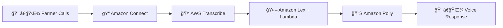

<h1 align="center">🌾 Welcome to KrishiMitra AI</h1>

---

## 👋 Welcome

Thank you for visiting the **KrishiMitra AI** repository.

This project was created to explore how **AI can empower rural farmers** by making agricultural knowledge accessible through a simple phone call.

---

## 🯠The Problem

Millions of farmers cannot use modern agriculture apps because of:

📵 Lack of smartphones  
ğŸ—£ï¸ Language barriers  
🌠Limited internet connectivity  
📚 Low digital literacy  

This creates a major **information gap** in rural India.

---

## 💡 Our Solution

KrishiMitra AI is a **voice-first helpline**.

📠Farmer calls → 🗣 Speaks in Hindi → 🤖 AI responds with guidance

No apps. No typing. No technical skills required.

---

## âš™ï¸ System Flow

```mermaid
flowchart LR
A[👨â€ğŸŒ¾ Farmer Calls] --> B[📠Amazon Connect]
B --> C[🤠AWS Transcribe]
C --> D[🤖 Amazon Lex + Lambda]
D --> E[🔊 Amazon Polly]
E --> F[👨â€ğŸŒ¾ Voice Response]
```
