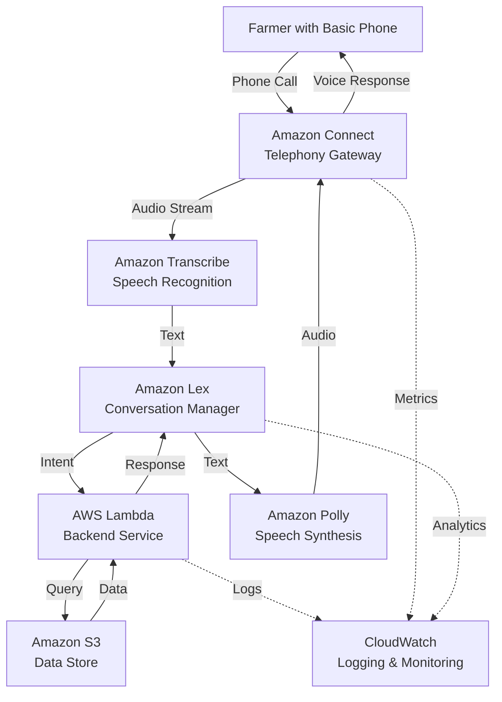

# Design Document: KrishiMitra AI

## Overview

KrishiMitra AI is a voice-based agricultural assistant accessible via phone calls that serves Indian farmers with limited digital literacy and basic mobile phones. The system leverages AWS services to provide a scalable, reliable, and accessible solution for delivering agricultural information, government schemes, weather updates, and crop guidance in Hindi.

The architecture follows a serverless, event-driven design that minimizes operational overhead while maximizing scalability and cost-efficiency. The system handles the complete voice interaction pipeline: receiving phone calls, converting speech to text, processing intents, retrieving relevant information, and synthesizing natural-sounding Hindi responses.

## Architecture

### High-Level Architecture



### Component Interaction Flow

1. **Call Initiation**: Farmer dials the KrishiMitra phone number
2. **Call Handling**: Amazon Connect receives the call and plays greeting
3. **Speech Capture**: Audio stream is sent to Amazon Transcribe
4. **Speech Recognition**: Transcribe converts Hindi speech to text with accent handling
5. **Intent Recognition**: Amazon Lex analyzes text to determine farmer's intent
6. **Business Logic**: Lambda function processes the intent and retrieves data from S3
7. **Response Generation**: Lambda returns structured response to Lex
8. **Speech Synthesis**: Amazon Polly converts response text to Hindi audio
9. **Response Delivery**: Connect plays the audio response to the farmer
10. **Conversation Loop**: Process repeats for follow-up questions until call ends

### Scalability Design

- **Serverless Architecture**: All compute resources scale automatically based on demand
- **Stateless Lambda Functions**: Enable horizontal scaling without session affinity
- **Connection Pooling**: Reuse connections to S3 and external APIs
- **Caching Layer**: Frequently accessed data cached in Lambda memory and CloudFront
- **Asynchronous Processing**: Non-critical operations handled asynchronously

## Components and Interfaces

### 1. Telephony Gateway (Amazon Connect)

**Responsibilities:**
- Accept incoming phone calls from farmers
- Manage call routing and queuing
- Stream audio to/from speech services
- Handle call termination and error scenarios
- Provide call metrics and analytics

**Configuration:**
- Contact flow for greeting and menu navigation
- Queue configuration for handling concurrent calls
- Integration with Lex for conversational AI
- Call recording settings (disabled for privacy)
- Timeout settings: 10-minute maximum call duration

**Interface:**
```
Input: PSTN phone call
Output: Audio stream to Transcribe/Polly
Events: CallStarted, CallEnded, CallFailed
```

### 2. Speech Recognition Engine (Amazon Transcribe)

**Responsibilities:**
- Convert Hindi speech to text in real-time
- Handle accent variations and background noise
- Provide confidence scores for transcriptions
- Support streaming audio input

**Configuration:**
- Language: Hindi (hi-IN)
- Custom vocabulary for agricultural terms
- Accent adaptation for rural Indian dialects
- Noise reduction enabled
- Confidence threshold: 60%

**Interface:**
```
Input: Audio stream (8kHz, mono, PCM)
Output: {
  transcript: string,
  confidence: float,
  alternatives: string[]
}
```

### 3. Conversation Manager (Amazon Lex)

**Responsibilities:**
- Recognize user intents from transcribed text
- Manage conversation context and state
- Handle slot filling for incomplete requests
- Route to appropriate Lambda functions
- Manage conversation flow and fallbacks

**Intents:**
- `GetGovernmentSchemes`: Retrieve scheme information
- `GetWeatherInfo`: Provide weather forecasts
- `GetCropGuidance`: Offer crop cultivation advice
- `GetFertilizerAdvice`: Recommend fertilizers
- `GetPestControl`: Suggest pest management
- `GetMarketPrices`: Provide crop price information
- `MainMenu`: Return to main menu
- `RepeatResponse`: Repeat last response
- `EndCall`: Terminate the session

**Slots:**
- `Location`: Farmer's district/village
- `CropName`: Specific crop mentioned
- `SchemeName`: Government scheme name
- `PestSymptoms`: Description of crop issues
- `SoilType`: Type of soil (clay, sandy, loamy)

**Interface:**
```
Input: {
  text: string,
  sessionId: string,
  sessionAttributes: object
}
Output: {
  intent: string,
  slots: object,
  dialogState: string,
  message: string
}
```

### 4. Backend Service (AWS Lambda)

**Responsibilities:**
- Process intents from Lex
- Query data from S3 and external APIs
- Apply business logic and filtering
- Format responses for voice delivery
- Log interactions and errors
- Manage caching for performance

**Functions:**

**a) Intent Handler**
```python
def lambda_handler(event, context):
    intent = event['currentIntent']['name']
    slots = event['currentIntent']['slots']
    session_attributes = event['sessionAttributes']
    
    # Route to appropriate handler
    if intent == 'GetGovernmentSchemes':
        return handle_schemes(slots, session_attributes)
    elif intent == 'GetWeatherInfo':
        return handle_weather(slots, session_attributes)
    # ... other intents
    
    return build_response(message, session_attributes)
```

**b) Scheme Handler**
```python
def handle_schemes(slots, session_attributes):
    # Retrieve farmer location from slots or session
    location = slots.get('Location') or session_attributes.get('location')
    
    # Query S3 for relevant schemes
    schemes = query_schemes(location)
    
    # Filter by eligibility
    relevant_schemes = filter_schemes(schemes, farmer_profile)
    
    # Format for voice response
    response = format_schemes_response(relevant_schemes[:3])
    
    return build_response(response, session_attributes)
```

**c) Weather Handler**
```python
def handle_weather(slots, session_attributes):
    location = slots.get('Location') or session_attributes.get('location')
    
    if not location:
        return elicit_slot('Location', "कृपया अपना जिला बताएं")
    
    # Fetch weather data
    weather_data = get_weather_forecast(location)
    
    # Format for voice
    response = format_weather_response(weather_data)
    
    # Store location in session
    session_attributes['location'] = location
    
    return build_response(response, session_attributes)
```

**Interface:**
```
Input: Lex event object
Output: {
  dialogAction: {
    type: string,
    message: {
      contentType: 'PlainText',
      content: string
    }
  },
  sessionAttributes: object
}
```

### 5. Speech Synthesis Engine (Amazon Polly)

**Responsibilities:**
- Convert text responses to natural Hindi speech
- Apply appropriate prosody and intonation
- Handle SSML markup for emphasis
- Generate audio in telephony-compatible format

**Configuration:**
- Language: Hindi (hi-IN)
- Voice: Aditi (female, Indian accent)
- Engine: Neural TTS for natural sound
- Output format: PCM 8kHz for telephony
- SSML support enabled

**SSML Usage:**
```xml
<speak>
    <prosody rate="slow">
        नमस्ते, मैं कृषि मित्र हूं।
    </prosody>
    <break time="500ms"/>
    मैं आपकी कैसे मदद कर सकती हूं?
</speak>
```

**Interface:**
```
Input: {
  text: string,
  voiceId: 'Aditi',
  engine: 'neural',
  languageCode: 'hi-IN'
}
Output: Audio stream (PCM)
```

### 6. Data Store (Amazon S3)

**Responsibilities:**
- Store agricultural data and guidance
- Store government scheme information
- Store market price data
- Provide fast data retrieval
- Support versioning for data updates

**Data Structure:**
```
s3://krishi-mitra-data/
├── schemes/
│   ├── central/
│   │   ├── pm-kisan.json
│   │   ├── fasal-bima.json
│   │   └── ...
│   └── state/
│       ├── maharashtra/
│       ├── punjab/
│       └── ...
├── crops/
│   ├── wheat.json
│   ├── rice.json
│   ├── cotton.json
│   └── ...
├── pests/
│   ├── bollworm.json
│   ├── aphids.json
│   └── ...
├── fertilizers/
│   ├── organic.json
│   └── chemical.json
├── market-prices/
│   ├── 2024-01-15.json
│   └── ...
└── weather-cache/
    └── ...
```

**Interface:**
```
Query: GET /schemes/{state}/{scheme-name}.json
Response: {
  name: string,
  eligibility: string[],
  benefits: string,
  applicationProcess: string,
  contactInfo: string
}
```

## Data Models

### Session Model
```python
{
  "sessionId": "uuid",
  "farmerId": "optional-phone-number",
  "startTime": "ISO-8601-timestamp",
  "endTime": "ISO-8601-timestamp",
  "location": "district-name",
  "intentsProcessed": ["intent1", "intent2"],
  "conversationTurns": 5,
  "completionStatus": "completed|dropped|error"
}
```

### Scheme Model
```python
{
  "schemeId": "string",
  "name": "string",
  "nameHindi": "string",
  "type": "central|state",
  "state": "string|null",
  "eligibility": {
    "landSize": "string",
    "cropTypes": ["string"],
    "farmerCategory": ["small|medium|large"]
  },
  "benefits": "string",
  "benefitsHindi": "string",
  "applicationProcess": "string",
  "applicationProcessHindi": "string",
  "documents": ["string"],
  "contactNumber": "string",
  "website": "string",
  "lastUpdated": "ISO-8601-date"
}
```

### Crop Model
```python
{
  "cropId": "string",
  "name": "string",
  "nameHindi": "string",
  "category": "cereal|pulse|oilseed|vegetable|fruit",
  "suitableSoil": ["clay", "sandy", "loamy"],
  "sowingPeriod": {
    "start": "month",
    "end": "month"
  },
  "harvestPeriod": {
    "start": "month",
    "end": "month"
  },
  "waterRequirement": "low|medium|high",
  "irrigationSchedule": "string",
  "fertilizers": {
    "basal": "string",
    "topDressing": "string"
  },
  "commonPests": ["pestId"],
  "yieldPerAcre": "string",
  "marketDemand": "low|medium|high"
}
```

### Weather Model
```python
{
  "location": "string",
  "date": "ISO-8601-date",
  "forecast": [
    {
      "day": "string",
      "temperature": {
        "min": float,
        "max": float
      },
      "rainfall": {
        "probability": float,
        "amount": "string"
      },
      "humidity": float,
      "windSpeed": float,
      "advisory": "string",
      "advisoryHindi": "string"
    }
  ],
  "alerts": [
    {
      "type": "heavy-rain|drought|storm",
      "severity": "low|medium|high",
      "message": "string",
      "messageHindi": "string"
    }
  ]
}
```

### Market Price Model
```python
{
  "cropId": "string",
  "cropName": "string",
  "date": "ISO-8601-date",
  "markets": [
    {
      "marketName": "string",
      "district": "string",
      "state": "string",
      "price": {
        "min": float,
        "max": float,
        "modal": float,
        "unit": "quintal"
      }
    }
  ],
  "trend": "rising|falling|stable",
  "weeklyChange": float
}
```

### Pest Model
```python
{
  "pestId": "string",
  "name": "string",
  "nameHindi": "string",
  "type": "insect|disease|weed",
  "affectedCrops": ["cropId"],
  "symptoms": ["string"],
  "symptomsHindi": ["string"],
  "treatment": {
    "organic": ["string"],
    "chemical": [
      {
        "name": "string",
        "dosage": "string",
        "applicationMethod": "string",
        "safetyPrecautions": "string"
      }
    ]
  },
  "preventiveMeasures": ["string"],
  "preventiveMeasuresHindi": ["string"]
}
```

### Interaction Log Model
```python
{
  "logId": "uuid",
  "sessionId": "uuid",
  "timestamp": "ISO-8601-timestamp",
  "intent": "string",
  "slots": object,
  "transcription": "string",
  "confidence": float,
  "responseTime": float,
  "errorOccurred": boolean,
  "errorDetails": "string|null"
}
```


## Correctness Properties

A property is a characteristic or behavior that should hold true across all valid executions of a system—essentially, a formal statement about what the system should do. Properties serve as the bridge between human-readable specifications and machine-verifiable correctness guarantees.

### Property 1: Call Acceptance
*For any* incoming phone call to the designated number, the Telephony Gateway should accept and establish the connection.
**Validates: Requirements 1.1**

### Property 2: Greeting Response Time
*For any* established call, the Voice Assistant should deliver the Hindi greeting within 3 seconds of connection.
**Validates: Requirements 1.2**

### Property 3: Connection Duration Support
*For any* active call, the Telephony Gateway should maintain the connection for the full 10-minute duration if needed.
**Validates: Requirements 1.3**

### Property 4: Session Termination and Logging
*For any* call that ends (farmer-initiated or timeout), the system should gracefully terminate the session and create a complete log entry with session ID, duration, intents processed, and completion status.
**Validates: Requirements 1.5, 10.2**

### Property 5: Hindi Speech Recognition
*For any* Hindi audio input from farmers, the Speech Recognition Engine should produce a text transcription with a confidence score.
**Validates: Requirements 2.1**

### Property 6: Hindi Speech Synthesis
*For any* text response generated by the system, the Speech Synthesis Engine should produce Hindi audio output.
**Validates: Requirements 2.2**

### Property 7: Accent Handling
*For any* Hindi utterance with rural accent variations, the Speech Recognition Engine should achieve at least 80% recognition accuracy.
**Validates: Requirements 2.3, 7.1**

### Property 8: Intent Recognition
*For any* valid Hindi phrase expressing a supported intent, the Conversation Manager should correctly identify the intent.
**Validates: Requirements 2.4**

### Property 9: Clarification on Low Confidence
*For any* utterance where Speech Recognition Engine confidence is below 60%, the Voice Assistant should request the farmer to repeat.
**Validates: Requirements 2.5, 7.2**

### Property 10: Data Retrieval for Requests
*For any* farmer request (schemes, weather, crops, prices), the Backend Service should retrieve relevant data from the Data Store.
**Validates: Requirements 3.1, 4.2, 5.1, 14.1**

### Property 11: Response Completeness
*For any* information response (scheme, weather, crop, fertilizer, pest), the Voice Assistant should include all required fields specified for that information type (e.g., schemes include eligibility, benefits, and application process; weather includes temperature, rainfall, and wind).
**Validates: Requirements 3.2, 4.3, 5.2, 6.3**

### Property 12: Specific Entity Lookup
*For any* request mentioning a specific entity by name (scheme name, crop name, pest name), the Backend Service should return information for that exact entity.
**Validates: Requirements 3.3, 5.4, 14.4**

### Property 13: Result Limiting
*For any* query matching multiple schemes, the Voice Assistant should return at most 3 schemes, ranked by relevance.
**Validates: Requirements 3.4**

### Property 14: Location Slot Filling
*For any* weather or regional query where location is not provided, the Voice Assistant should ask the farmer for their location before proceeding.
**Validates: Requirements 4.1**

### Property 15: Forecast Duration
*For any* weather response, the system should provide forecast data for exactly 4 days (current day plus next 3 days).
**Validates: Requirements 4.4**

### Property 16: Severe Weather Alerts
*For any* weather forecast containing severe conditions (heavy rain, storm, drought), the Voice Assistant should include a proactive warning in the response.
**Validates: Requirements 4.5**

### Property 17: Soil-Based Crop Filtering
*For any* crop recommendation request that includes soil type, the Backend Service should return only crops suitable for that soil type.
**Validates: Requirements 5.3**

### Property 18: Pest Identification from Symptoms
*For any* description of crop symptoms, the Backend Service should identify at least one potential pest or disease that matches those symptoms.
**Validates: Requirements 6.1**

### Property 19: Treatment Recommendations
*For any* identified pest or disease, the Voice Assistant should provide at least one treatment method (organic or chemical).
**Validates: Requirements 6.2**

### Property 20: Organic Alternative Inclusion
*For any* pest treatment response where organic alternatives exist in the data, the Voice Assistant should include those organic options.
**Validates: Requirements 6.4**

### Property 21: Chemical Safety Information
*For any* chemical treatment recommendation, the Voice Assistant should include safety precautions in the response.
**Validates: Requirements 6.5**

### Property 22: Background Noise Resilience
*For any* audio input containing background noise typical of rural environments, the Speech Recognition Engine should still produce a transcription.
**Validates: Requirements 7.3**

### Property 23: Code-Switching Support
*For any* utterance containing both Hindi and English words, the Speech Recognition Engine should recognize words from both languages.
**Validates: Requirements 7.4**

### Property 24: Misrecognition Logging
*For any* speech recognition event, the Backend Service should log the transcription, confidence score, and timestamp.
**Validates: Requirements 7.5, 10.3**

### Property 25: Clarification on Ambiguity
*For any* unclear or ambiguous farmer request, the Voice Assistant should offer clarifying options or questions.
**Validates: Requirements 8.2**

### Property 26: Context Preservation
*For any* multi-turn conversation within a session, the Conversation Manager should maintain context from previous turns, including remembered location and previous intents.
**Validates: Requirements 8.3, 13.1, 13.5**

### Property 27: Main Menu Navigation
*For any* point in a conversation, the farmer should be able to request return to the main menu, and the Voice Assistant should provide it.
**Validates: Requirements 8.4**

### Property 28: Data Store Response Time
*For any* data request from Backend Service to Data Store, the response should be received within 2 seconds.
**Validates: Requirements 9.4**

### Property 29: Caching Performance Improvement
*For any* data that is requested multiple times, the second and subsequent requests should be served faster than the first request due to caching.
**Validates: Requirements 9.5**

### Property 30: Unique Session Identifiers
*For any* two different sessions, the system should generate different unique session identifiers.
**Validates: Requirements 10.1**

### Property 31: Request Type Tracking
*For any* session, the Backend Service should track and log which information types (intents) were requested.
**Validates: Requirements 10.4**

### Property 32: Error Logging
*For any* system error (recognition failure, data retrieval failure, service failure), the Backend Service should create a log entry with error details.
**Validates: Requirements 10.5**

### Property 33: Speech Recognition Failure Recovery
*For any* speech recognition failure, the Voice Assistant should ask the farmer to speak again rather than ending the call.
**Validates: Requirements 11.1**

### Property 34: Data Retrieval Failure Handling
*For any* data retrieval failure, the Voice Assistant should inform the farmer and offer alternative options rather than failing silently.
**Validates: Requirements 11.2**

### Property 35: Intent Recognition Fallback
*For any* utterance where intent cannot be determined, the Voice Assistant should present the main menu as a fallback.
**Validates: Requirements 11.3**

### Property 36: Cache Fallback on Service Failure
*For any* external service failure, if cached data exists for the request, the Backend Service should serve the cached data.
**Validates: Requirements 11.4**

### Property 37: Critical Failure Helpline
*For any* critical system failure that prevents service continuation, the Voice Assistant should provide a helpline number before ending the call.
**Validates: Requirements 11.5**

### Property 38: End-to-End Response Time
*For any* farmer utterance, the Voice Assistant should begin delivering the audio response within 3 seconds of utterance completion.
**Validates: Requirements 12.1**

### Property 39: Component Latency Bounds
*For any* request, the Speech Recognition Engine should complete within 2 seconds, Backend Service processing within 2 seconds, and Speech Synthesis within 1 second.
**Validates: Requirements 12.2, 12.3, 12.4**

### Property 40: Response Conciseness
*For any* voice response, the speaking duration should not exceed 30 seconds.
**Validates: Requirements 12.5**

### Property 41: Conversation Depth Support
*For any* single intent, the Conversation Manager should support up to 10 conversation turns without losing context.
**Validates: Requirements 13.2**

### Property 42: Topic Switching
*For any* conversation where the farmer switches from one intent to another, the Conversation Manager should recognize the new intent and establish new context.
**Validates: Requirements 13.3**

### Property 43: Contextual Clarification
*For any* clarification request, the Voice Assistant should ask questions that are specific to the current conversation context.
**Validates: Requirements 13.4**

### Property 44: Geographic Price Filtering
*For any* market price response, the Voice Assistant should include only markets that are geographically near the farmer's location.
**Validates: Requirements 14.2**

### Property 45: Price Trend Inclusion
*For any* market price response, the system should include both current day prices and price trends from the past week.
**Validates: Requirements 14.3**

### Property 46: Call Queue Management
*For any* situation where incoming calls exceed the 100 concurrent call capacity, the Telephony Gateway should queue additional calls and announce wait times.
**Validates: Requirements 15.2**

### Property 47: Auto-Scaling Behavior
*For any* increase in request volume, the Backend Service should automatically scale up to handle the load.
**Validates: Requirements 15.3**

### Property 48: Concurrent Stream Processing
*For any* set of concurrent calls, the Speech Recognition Engine should process all audio streams simultaneously without blocking.
**Validates: Requirements 15.4**

### Property 49: Performance Under Load
*For any* high system load scenario, the Backend Service should maintain response times within the specified latency bounds (2 seconds for data retrieval).
**Validates: Requirements 15.5**


## Error Handling

### Error Categories

**1. Speech Recognition Errors**
- Low confidence transcription (< 60%)
- Audio quality issues
- Unrecognized language or accent
- Background noise interference

**Handling Strategy:**
- Request farmer to repeat utterance
- Offer alternative input methods (menu-based navigation)
- Log low-confidence transcriptions for model improvement
- Provide patient, encouraging feedback in Hindi

**2. Intent Recognition Errors**
- Ambiguous or unclear requests
- Out-of-scope queries
- Intent confidence below threshold

**Handling Strategy:**
- Present clarifying questions with options
- Fall back to main menu presentation
- Suggest similar available services
- Never leave farmer without guidance

**3. Data Retrieval Errors**
- S3 access failures
- Missing data for requested entity
- Stale or outdated data
- External API failures (weather, prices)

**Handling Strategy:**
- Serve cached data when available
- Inform farmer of temporary unavailability
- Offer alternative information types
- Retry with exponential backoff for transient failures
- Log all failures for monitoring

**4. Service Availability Errors**
- Lambda timeout or cold start delays
- Lex service unavailability
- Transcribe/Polly service failures
- Connect infrastructure issues

**Handling Strategy:**
- Implement circuit breaker pattern
- Use cached responses for common queries
- Provide graceful degradation (simpler responses)
- Offer helpline number for critical failures
- Automatic retry for transient failures

**5. Conversation Flow Errors**
- Context loss due to long pauses
- Unexpected user responses
- Slot filling failures
- Session timeout

**Handling Strategy:**
- Maintain session state in DynamoDB for recovery
- Implement conversation repair strategies
- Offer to start over from main menu
- Provide clear navigation options

### Error Response Templates

**Low Confidence:**
```
"क्षमा करें, मैं आपकी बात समझ नहीं पाई। कृपया फिर से बोलें।"
(Sorry, I couldn't understand. Please speak again.)
```

**Data Unavailable:**
```
"क्षमा करें, यह जानकारी अभी उपलब्ध नहीं है। क्या मैं आपकी कोई और मदद कर सकती हूं?"
(Sorry, this information is not available right now. Can I help you with something else?)
```

**Service Failure:**
```
"तकनीकी समस्या के कारण मैं अभी यह जानकारी नहीं दे पा रही हूं। कृपया हमारी हेल्पलाइन पर संपर्क करें: 1800-XXX-XXXX"
(Due to technical issues, I cannot provide this information right now. Please contact our helpline: 1800-XXX-XXXX)
```

**Ambiguous Request:**
```
"मैं आपकी मदद करना चाहती हूं। क्या आप चाहते हैं: 1. मौसम की जानकारी, 2. फसल की सलाह, या 3. सरकारी योजनाएं?"
(I want to help you. Do you want: 1. Weather information, 2. Crop advice, or 3. Government schemes?)
```

### Monitoring and Alerting

**Key Metrics:**
- Speech recognition accuracy rate
- Intent recognition accuracy rate
- Average response time per component
- Error rate by category
- Call completion rate
- Session duration distribution
- Cache hit rate

**Alerts:**
- Error rate exceeds 5% threshold
- Response time exceeds SLA (3 seconds)
- Service availability drops below 99%
- Data staleness exceeds 24 hours
- Concurrent call capacity approaching limit

**Logging Strategy:**
- All errors logged to CloudWatch with context
- Structured logging with correlation IDs
- Separate log groups for each component
- Retention: 30 days for debugging, 1 year for analytics
- PII scrubbing for privacy compliance

## Testing Strategy

### Overview

The testing strategy employs a dual approach combining unit tests for specific scenarios and property-based tests for universal correctness guarantees. This ensures both concrete bug detection and comprehensive coverage across the input space.

### Unit Testing

**Purpose:** Validate specific examples, edge cases, and integration points.

**Scope:**
- Lambda function handlers for each intent
- Data retrieval and formatting logic
- Error handling paths
- Session management
- Response template rendering
- Cache behavior

**Example Unit Tests:**

```python
def test_scheme_handler_with_location():
    """Test scheme retrieval for a specific location"""
    event = create_lex_event('GetGovernmentSchemes', {'Location': 'Punjab'})
    response = lambda_handler(event, None)
    assert response['dialogAction']['type'] == 'Close'
    assert 'PM-KISAN' in response['dialogAction']['message']['content']

def test_weather_handler_missing_location():
    """Test weather request without location triggers slot elicitation"""
    event = create_lex_event('GetWeatherInfo', {})
    response = lambda_handler(event, None)
    assert response['dialogAction']['type'] == 'ElicitSlot'
    assert response['dialogAction']['slotToElicit'] == 'Location'

def test_low_confidence_transcription():
    """Test that low confidence triggers repeat request"""
    transcription = {'confidence': 0.45, 'transcript': 'unclear'}
    response = handle_transcription(transcription)
    assert 'फिर से बोलें' in response  # "speak again" in Hindi

def test_data_retrieval_failure_fallback():
    """Test cache fallback when S3 is unavailable"""
    with mock_s3_failure():
        response = get_scheme_data('PM-KISAN')
        assert response is not None  # Should serve from cache
        assert response['source'] == 'cache'
```

**Edge Cases to Test:**
- Empty or null inputs
- Extremely long utterances
- Special characters in farmer input
- Concurrent session conflicts
- Cache expiration boundaries
- Network timeout scenarios

### Property-Based Testing

**Purpose:** Verify universal properties hold across all valid inputs through randomized testing.

**Configuration:**
- Framework: Hypothesis (Python) or fast-check (TypeScript)
- Minimum iterations: 100 per property
- Each test tagged with feature name and property number
- Shrinking enabled for minimal failing examples

**Property Test Examples:**

```python
from hypothesis import given, strategies as st

@given(st.text(alphabet=st.characters(whitelist_categories=('Ll', 'Lu')), min_size=1))
def test_property_6_hindi_speech_synthesis(response_text):
    """
    Property 6: Hindi Speech Synthesis
    For any text response, Speech Synthesis Engine produces Hindi audio
    Feature: krishi-mitra-ai, Property 6
    """
    audio = synthesize_speech(response_text, language='hi-IN')
    assert audio is not None
    assert audio.content_type == 'audio/pcm'
    assert len(audio.data) > 0

@given(st.text(min_size=1), st.floats(min_value=0.0, max_value=1.0))
def test_property_9_clarification_on_low_confidence(utterance, confidence):
    """
    Property 9: Clarification on Low Confidence
    For any utterance with confidence < 60%, system requests repeat
    Feature: krishi-mitra-ai, Property 9
    """
    transcription = {'transcript': utterance, 'confidence': confidence}
    response = handle_transcription(transcription)
    
    if confidence < 0.6:
        assert 'फिर से बोलें' in response or 'repeat' in response.lower()

@given(st.lists(st.text(min_size=1), min_size=1, max_size=10))
def test_property_13_result_limiting(matching_schemes):
    """
    Property 13: Result Limiting
    For any query matching multiple schemes, return at most 3
    Feature: krishi-mitra-ai, Property 13
    """
    response = format_scheme_results(matching_schemes)
    schemes_in_response = extract_schemes(response)
    assert len(schemes_in_response) <= 3

@given(st.integers(min_value=1, max_value=1000))
def test_property_30_unique_session_identifiers(num_sessions):
    """
    Property 30: Unique Session Identifiers
    For any two different sessions, generate different IDs
    Feature: krishi-mitra-ai, Property 30
    """
    session_ids = [create_session_id() for _ in range(num_sessions)]
    assert len(session_ids) == len(set(session_ids))  # All unique

@given(st.text(min_size=1), st.integers(min_value=1, max_value=10))
def test_property_41_conversation_depth_support(initial_query, num_turns):
    """
    Property 41: Conversation Depth Support
    For any intent, support up to 10 conversation turns
    Feature: krishi-mitra-ai, Property 41
    """
    session = create_session()
    
    for turn in range(min(num_turns, 10)):
        response = process_turn(session, f"follow-up {turn}")
        assert response is not None
        assert session.context is not None
    
    # Should maintain context through all turns
    assert session.turn_count == min(num_turns, 10)
```

**Property Test Coverage:**
- All 49 correctness properties from design document
- Each property maps to specific requirements
- Generators create realistic test data (Hindi text, valid locations, crop names)
- Custom strategies for domain-specific data (schemes, weather, crops)

### Integration Testing

**Scope:**
- End-to-end call flow simulation
- AWS service integration (Connect, Lex, Lambda, S3)
- Multi-turn conversation scenarios
- Error recovery flows

**Approach:**
- Use AWS SDK mocks for local testing
- Deploy to test environment for full integration
- Simulate various farmer personas and queries
- Test with recorded audio samples from target users

**Test Scenarios:**
- Complete weather query flow
- Scheme information with follow-up questions
- Crop guidance with pest identification
- Market price inquiry with location
- Error scenarios and recovery
- Session timeout and reconnection

### Performance Testing

**Load Testing:**
- Simulate 100 concurrent calls
- Measure response times under load
- Verify auto-scaling behavior
- Test queue management at capacity

**Latency Testing:**
- Measure component-level latency
- Verify end-to-end response time < 3 seconds
- Test with various network conditions
- Identify bottlenecks

**Tools:**
- Apache JMeter for load generation
- CloudWatch for metrics collection
- X-Ray for distributed tracing

### Acceptance Testing

**User Acceptance:**
- Test with actual farmers in pilot regions
- Gather feedback on voice quality and comprehension
- Validate information accuracy and relevance
- Assess ease of use and navigation

**Criteria:**
- 80% of farmers can complete primary tasks
- 90% satisfaction with voice quality
- Average call duration under 5 minutes
- 95% of information requests successfully fulfilled

### Continuous Testing

**CI/CD Pipeline:**
- Unit tests run on every commit
- Property tests run on pull requests
- Integration tests run on staging deployment
- Performance tests run weekly
- Automated regression testing

**Test Data Management:**
- Synthetic test data for development
- Anonymized production data for staging
- Regular updates to scheme and crop data
- Version control for test datasets

### Test Coverage Goals

- Unit test coverage: 80% of code
- Property test coverage: 100% of correctness properties
- Integration test coverage: All critical user flows
- Error path coverage: All error handling branches

### Testing Tools and Frameworks

**Python Stack:**
- pytest: Unit test framework
- Hypothesis: Property-based testing
- moto: AWS service mocking
- pytest-cov: Coverage reporting

**TypeScript Stack:**
- Jest: Unit test framework
- fast-check: Property-based testing
- aws-sdk-mock: AWS service mocking
- Istanbul: Coverage reporting

**Infrastructure:**
- LocalStack: Local AWS service emulation
- Docker: Containerized test environments
- GitHub Actions: CI/CD automation
